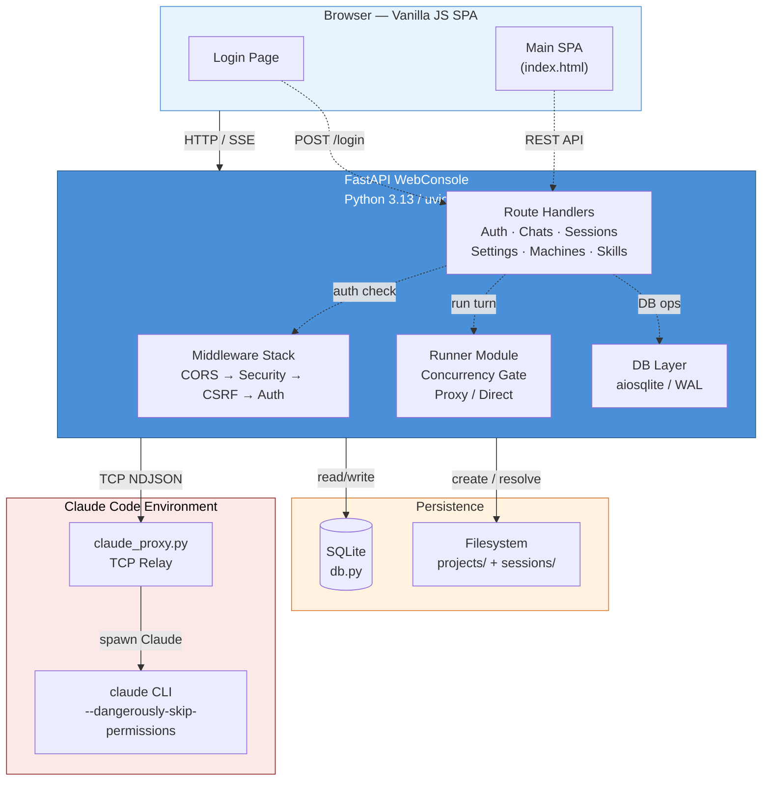
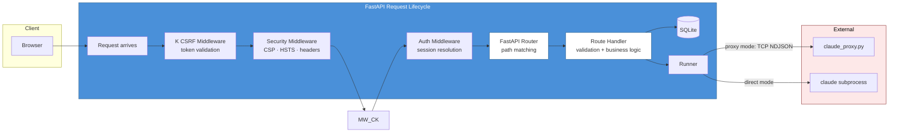
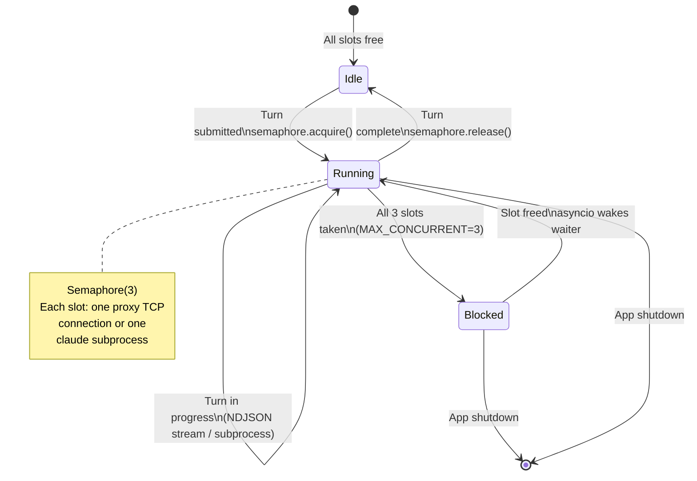
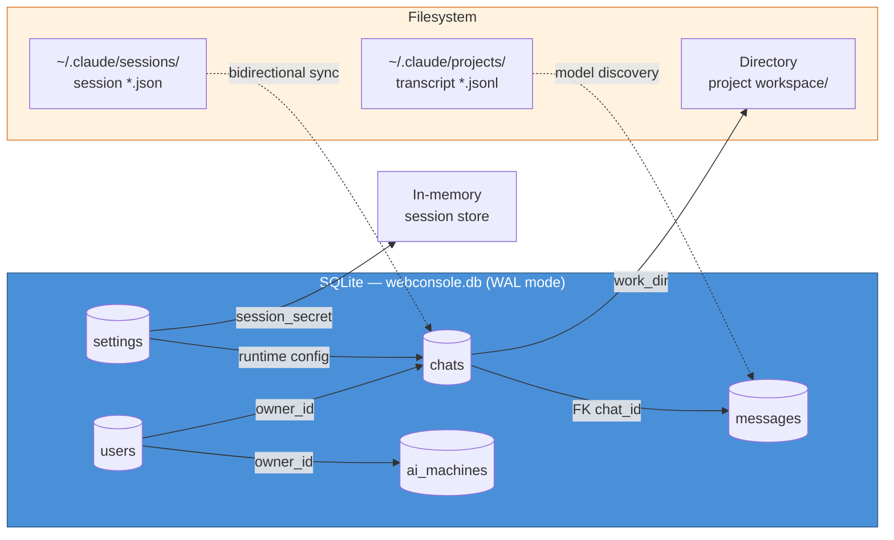
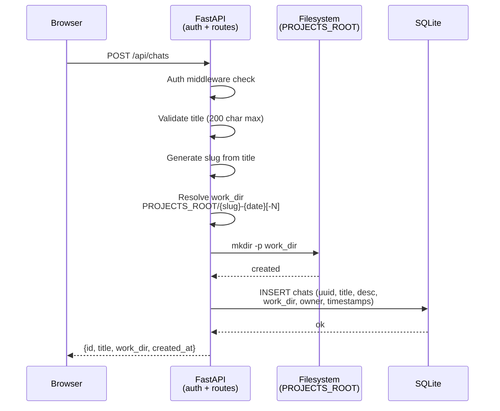
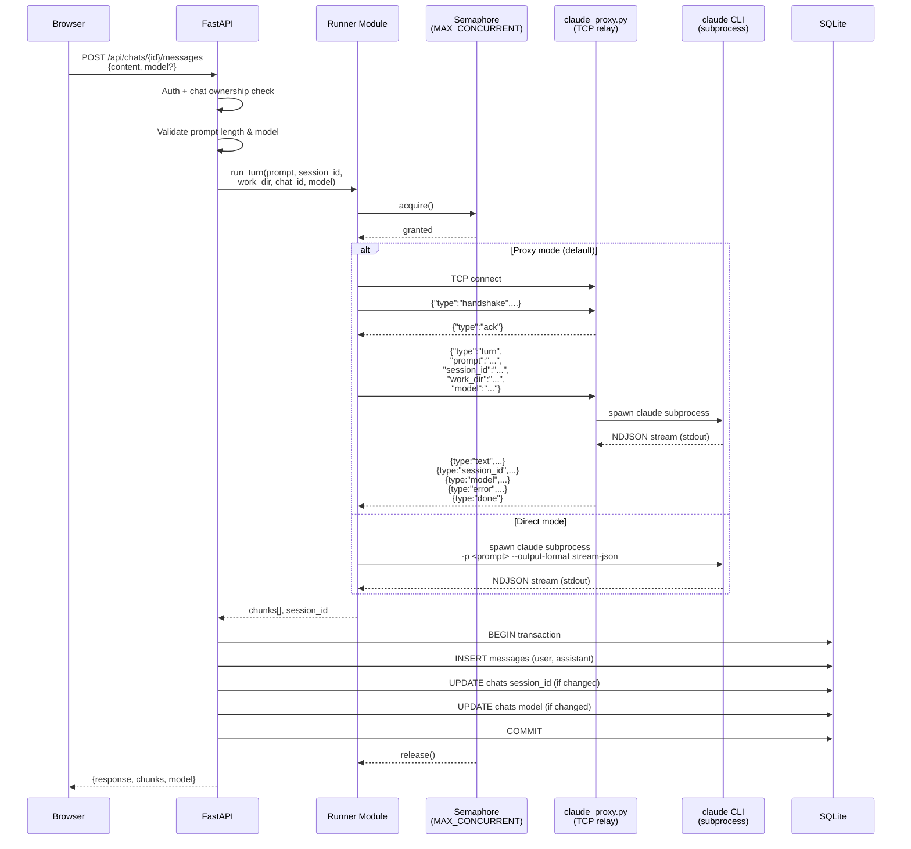
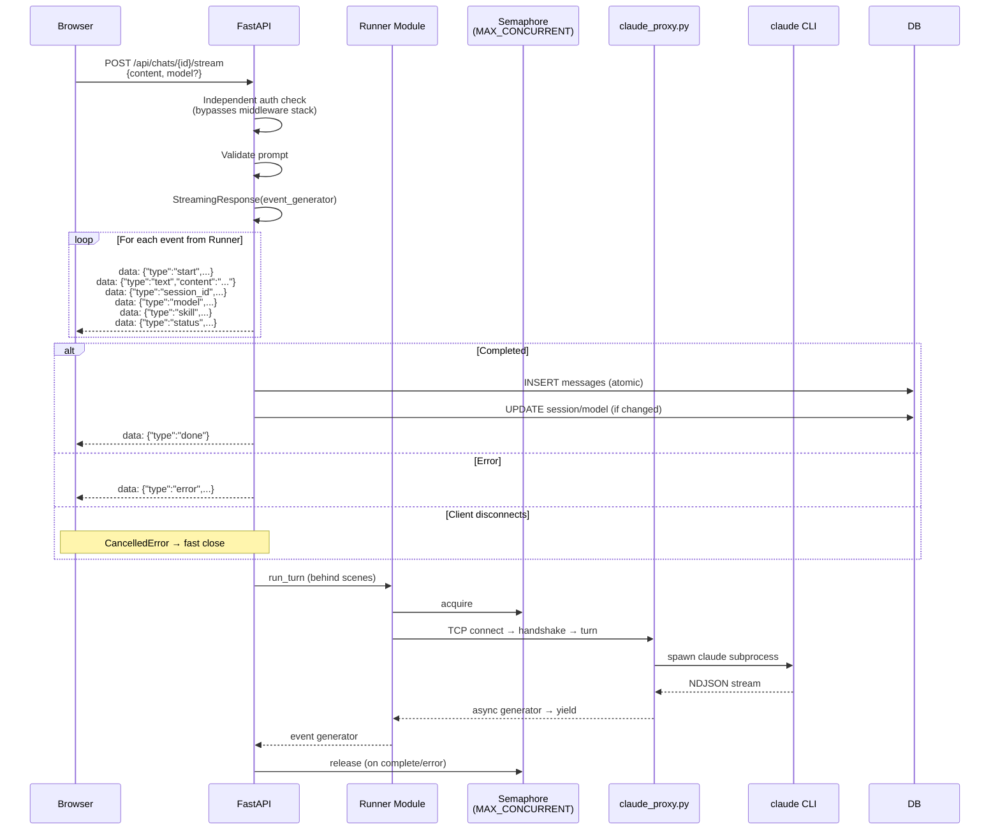
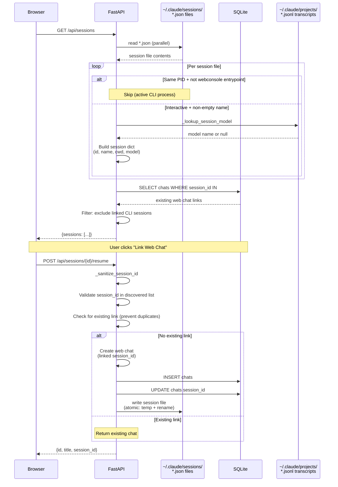
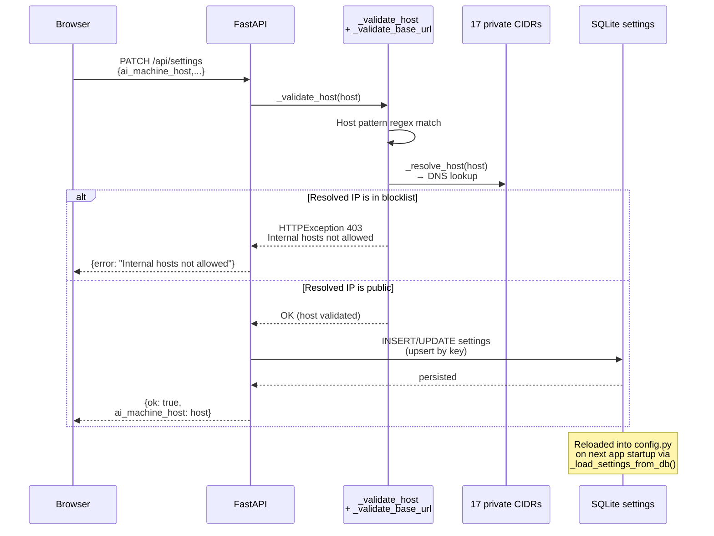

# WebConsole — Architecture Document

A self-hosted web interface for a local Claude Code CLI. It provides mobile-friendly conversations, SSE token streaming, SQLite persistence, resumable CLI sessions, multi-machine AI routing, and skills inventory.

**Version:** 0.6.0
**License:** Proprietary

---

## Table of Contents

1. [High-Level Overview](#1-high-level-overview)
2. [Architecture Diagram](#2-architecture-diagram)
3. [Component Breakdown](#3-component-breakdown)
4. [Data Flow](#4-data-flow)
5. [Database Schema](#5-database-schema)
6. [API Reference](#6-api-reference)
7. [Security Model](#7-security-model)
8. [Configuration](#8-configuration)
9. [File Inventory](#9-file-inventory)
10. [Deployment Options](#10-deployment-options)
11. [Testing Strategy](#11-testing-strategy)
12. [Development Workflow](#12-development-workflow)

---

## 1. High-Level Overview

WebConsole bridges a web browser and the Claude Code CLI. A single authenticated user manages chat conversations through a vanilla-JS SPA. Each conversation gets a dedicated workspace directory under `PROJECTS_ROOT`. Messages and metadata are stored in a single SQLite file.

**Two execution modes:**

| Mode | How it works | When to use |
|------|--------------|-------------|
| **Direct** | FastAPI spawns `claude` as a subprocess, reads stream-json NDJSON from stdout | Web app and Claude Code on the same machine |
| **Proxy** | FastAPI connects to a host-side TCP proxy (`claude_proxy.py`) which spawns Claude | FastAPI runs in a container; Claude lives on the host |

The proxy mode is the default and recommended path. The proxy handles Claude's stream-json output, normalizes it into a simple event protocol, and relays events back over TCP.

---

## 2. Architecture Diagrams

### 2.1 System Context Diagram



### 2.2 Request Processing Pipeline



### 2.3 Concurrency Model



### 2.4 Data Storage Map



---

## 3. Component Breakdown

### 3.1 `app.py` — FastAPI Application (1370 lines)

The single entry point. Registers all routes, middleware, and endpoint handlers.

**Middleware stack** (applied top-to-bottom = outermost-to-innermost):
1. **CORSMiddleware** — Origins empty (deny-all), methods/headers wildcard. Locks down cross-origin traffic.
2. **SecurityMiddleware** — Injects CSP (with per-request nonce), HSTS, X-Frame-Options, X-Content-Type-Options, Cache-Control on every response.
3. **CsrfMiddleware** — Validates `X-CSRF-Token` header matches `wc_csrf` cookie on all mutating requests. `POST /login` is exempt (session cookie itself is the CSRF guard).
4. **AuthMiddleware** — Resolves `wc_session` cookie to a session dict via `auth.session_get()`, attaches `request.state.session`. Blocks unauthenticated access to all routes except `/login` and `/assets/`.

**Route groups:**

| Prefix | Method | Handler | Purpose |
|--------|--------|---------|---------|
| `/` | GET | `handle_index` | Serve main SPA |
| `/login` | GET | `handle_login_page` | Serve login page with CSP nonce |
| `/login` | POST | `handle_login` | Authenticate, set session + CSRF cookies |
| `/logout` | POST | `handle_logout` | Clear session cookie |
| `/assets/*` | — | `StaticFiles` | Serve JS/CSS/images |
| `/api/chats` | GET | `handle_chats_list` | List chats scoped to `owner_id` |
| `/api/chats` | POST | `handle_chat_create` | Create chat + workspace directory |
| `/api/chats/{id}` | GET | `handle_chat_get` | Chat metadata + full transcript |
| `/api/chats/{id}` | PATCH | `handle_chat_patch` | Rename, desc, archive, pin |
| `/api/chats/{id}` | DELETE | `handle_chat_delete` | Hard delete chat + messages |
| `/api/chats/{id}/export` | GET | `handle_chat_export` | Download Markdown transcript |
| `/api/chats/{id}/messages` | POST | `handle_submit_message` | Blocking turn (wait for full response) |
| `/api/chats/{id}/stream` | POST | `stream_handler` | SSE token stream |
| `/api/skills` | GET | `handle_skills_get` | List installed skills + active set |
| `/api/settings` | GET | `handle_settings_get` | Runtime config (non-secret) |
| `/api/settings` | PATCH | `handle_settings_patch` | Update runtime config + secrets |
| `/api/sessions` | GET | `handle_sessions_list` | CLI sessions + web chats for sidebar |
| `/api/sessions/{id}/resume` | POST | `handle_sessions_resume` | Create web chat from CLI session |
| `/api/machines` | GET | `handle_machines_list` | List AI machines (no keys) |
| `/api/machines` | POST | `handle_machine_create` | Create AI machine config |
| `/api/machines/{id}` | GET | `handle_machine_get` | Machine details |
| `/api/machines/{id}` | PATCH | `handle_machine_patch` | Update machine config |
| `/api/machines/{id}/activate` | POST | `handle_machine_activate` | Set active machine |
| `/api/machines/{id}/test` | POST | `handle_machine_test` | Connectivity test (with SSRF check) |
| `/api/machines/{id}` | DELETE | `handle_machine_delete` | Remove machine config |

**SSRF protection:**
- `_BLOCKED_NETS` — 17 private/reserved CIDRs (RFC 1918, CG-NAT, loopback, link-local, IETF, test-net, multicast, reserved, IPv6 equivalents).
- `_resolve_host()` — Resolves hostname to IP, checks against blocklist, used at outbound connection time (machine test, proxy).
- `_validate_host()` — Format-only check (hostname or IP pattern). Intentionally does NOT block private IPs at input time — allows configuration of `127.0.0.1` or `10.0.0.1` as valid hosts.

### 3.2 `runner.py` — Claude Code Invocation (737 lines)

Manages how prompts reach Claude Code. Two modes, two transport paths, each with blocking and streaming variants.

**Concurrency gate:** Singleton `asyncio.Semaphore(config.MAX_CONCURRENT)` (default 3). Every turn acquires it before proceeding.

**In-process state:**
- `_models_by_chat[chat_id]` — Last model reported by a blocking turn (consumed by `take_last_model()`).
- `_skills_by_session[session_id]` — Set of skill names observed during a streaming turn.

**Execution paths:**

```
run_turn() / stream_turn()
  │
  ├─ PROXY_ENABLED=True (default)
  │   ├─ _proxy_turn()          → _execute_proxy()  (blocking: collects then returns)
  │   └─ _proxy_stream_turn()   → _do_proxy_stream() (streaming: yields events)
  │
  └─ PROXY_ENABLED=False (legacy)
      ├─ _execute_direct()      (blocking: collects then returns)
      └─ _execute_direct_stream() (streaming: yields events)
```

**Proxy protocol (NDJSON over TCP):**
```
Runner → Proxy: {"type":"handshake","protocol":"webconsole-v1","token":"..."}
Proxy → Runner: {"type":"ack"}
Runner → Proxy: {"type":"turn","prompt":"...","session_id":"...","work_dir":"...","model":"..."}
Proxy → Runner: {"type":"session_id",...}  {"type":"model",...}  {"type":"skill",...}  {"type":"text",...}  {"type":"status",...}  {"type":"error",...}  {"type":"done"}
```

**Direct mode:** Spawns `claude -p <prompt> --output-format stream-json --verbose --dangerously-skip-permissions [--model <m>] -- [--resume|session-id <id>]`. Reads NDJSON from stdout, parses via `_normalise_cli_frame()`.

**NDJSON normalization** (`_normalise_cli_frame()`): Translates Claude's internal event shapes (system/api_retry, assistant, message, result, error) into a flat event list the runner and SSE handler both understand.

### 3.3 `auth.py` — Authentication (not shown in full, inferred from usage)

- **Password hashing:** Argon2id primary, scrypt fallback.
- **Session storage:** In-memory dict keyed by opaque session ID.
- **Session fixation protection:** New session + new CSRF token on every login.
- **CSRF tokens:** `_csrf_valid()` compares cookie token to header token.
- **Rate limiting:** `_login_attempts[ip]` tracks failures with bounded exponential backoff. 10 attempts per 5-minute window, then 30-second backoff.
- **Admin bootstrap:** `bootstrap_admin()` creates the first user from `WC_ADMIN_USER` / `WC_ADMIN_PASSWORD` env vars, then is idempotent.
- **Cookie helpers:** `set_session_cookie()`, `clear_session_cookie()` — HttpOnly, SameSite=Strict, Secure (unless `COOKIE_ALLOW_INSECURE`).

### 3.4 `db.py` — SQLite Persistence (747 lines)

Single SQLite file, async via `aiosqlite`, WAL mode, foreign keys enabled.

**Bootstrap:** `init()` creates all tables and runs additive migrations. `close()` shuts down.

**Settings table:** Key-value store for runtime configuration (secrets, models, timeouts, hosts). Loaded from DB into `config.py` at startup via `_load_settings_from_db()`.

**Chat CRUD:** `chat_list` (owner-scoped, sorted: unarchived → pinned → recency), `chat_get`, `chat_create`, `chat_update` (allowlist: title, description, archived, pinned), `chat_delete` (atomic transaction: messages + chats), `chat_archive`, `chat_set_session`, `chat_set_model`, `chat_set_title`.

**Messages:** `messages_get`, `messages_append`, `messages_batch` (atomic, uses asyncio.Lock to prevent race conditions).

**AI Machines:** `ai_machine_active`, `ai_machines_list`, `ai_machine_get`, `ai_machine_create`, `ai_machine_update`, `ai_machine_activate` (atomic deactivation of all others), `ai_machine_delete`.

**CLI Session Integration:**
- `read_claude_sessions()` — Scans `~/.claude/sessions/*.json`, filters active process, returns list of interactive sessions with model discovery.
- `write_claude_session_file()` — Writes session file for bidirectional sync (web → CLI). Atomic write (temp + rename). Path-traversal protection on session_id.
- `_extract_model_from_transcript()` — Scans `~/.claude/projects/*.jsonl` for assistant messages matching session_id, returns last non-synthetic model.
- `_lookup_session_model()` — In-process cache keyed by session_id.

### 3.5 `claude_proxy.py` — Host-Side TCP Proxy (419 lines)

Standalone server that bridges one authenticated TCP client to one Claude Code subprocess.

**Lifecycle per connection:**
1. Read handshake JSON, verify protocol + HMAC token.
2. Send ACK.
3. Wait for turn payload (300s timeout).
4. Launch Claude subprocess with resolved command.
5. Concurrent tasks: relay stdout → client, collect stderr, wait for process, wait for client disconnect.
6. Handle timeout/cancel/exit. Send done or error. Close connection.

**Claude normalization** (`normalise_claude_frame()`): Same frame translation as runner but also handles `tool_use` frames (extracts skill names).

**Fallback working directory:** If Docker-internal `work_dir` doesn't exist on host, falls back to `WC_PROXY_FALLBACK_DIR` (default `/tmp`).

### 3.6 `config.py` — Configuration (104 lines)

Environment-driven fail-fast config. All values from `os.environ` with defaults. Validates `SESSION_SECRET` (≥32 chars), `PROJECTS_ROOT` (non-empty), `PROXY_TOKEN` (≥32 chars when proxy mode).

Key settings:
| Setting | Default | Description |
|---------|---------|-------------|
| `HOST` / `LISTEN_HOST` | `127.0.0.1` | Bind address |
| `PORT` | `8080` | Web port |
| `DB_PATH` | `./data/webconsole.db` | SQLite file |
| `PROJECTS_ROOT` | `./projects` | Workspace root |
| `PROXY_ENABLED` | `True` | Use proxy mode |
| `PROXY_HOST` / `PROXY_PORT` | `127.0.0.1:9000` | Proxy target |
| `MAX_CONCURRENT` | `3` | Claude processes |
| `TURN_TIMEOUT_S` | `300` | Per-turn wall-clock |
| `PROMPT_MAX_CHARS` | `8000` | Prompt length cap |
| `SESSION_TTL_S` | `7200` | Absolute session TTL |
| `SESSION_IDLE_S` | `1800` | Idle timeout |
| `SESSION_MAX` | `50` | Hard cap |

### 3.7 Web Frontend (5 files, ~65 KB)

| File | Size | Purpose |
|------|------|---------|
| `web/index.html` | ~9.6 KB | Main SPA shell (sidebar + chat area + settings/machines tabs) |
| `web/login.html` | ~5 KB | Login page with CSP nonce injection |
| `web/assets/app.js` | ~28 KB | Core: auth flow, API layer, chat CRUD, SSE streaming, skills, settings, machine management |
| `web/assets/chat-list.js` | ~8 KB | Sidebar chat list: create, pin, archive, resume CLI sessions, model selector |
| `web/assets/conversation.js` | ~12 KB | Message rendering, markdown, export, model dropdown per-chat |
| `web/assets/styles.css` | ~14 KB | Full stylesheet (light/dark theme variables, responsive layout) |
| `web/assets/api.js` | ~1.6 KB | `escapeHtml()`, fetch wrapper with CSRF token injection |
| `web/assets/favicon.svg` | ~400 B | Favicon |

**Security patterns in client JS:**
- Single `escapeHtml()` function for XSS mitigation — all interpolated values escaped.
- `AbortController` on SSE streams — navigation aborts lingering requests.
- No `eval()`, no inline event handlers.
- CSRF token injected from `wc_csrf` cookie on every mutating request.

---

## 4. Data Flows

### 4.1 Chat Creation



### 4.2 Message Submission — Blocking Mode



### 4.3 Message Submission — SSE Streaming Mode



### 4.4 CLI Session Discovery and Resume



### 4.5 Settings Update with SSRF Protection



### 4.6 Login and Session Lifecycle

```mermaid
sequenceDiagram
    participant Browser
    participant App as FastAPI
    participant DB as SQLite
    participant Auth as auth module<br/>(sessions + rate limit)

    Browser->>App: POST /login {username, password}
    App->>Auth: login_attempt_flood(ip)
    alt Rate limited (11th failure)
        Auth-->>App: True (backoff required)
        App-->>Browser: 429 + Retry-After header
    else Within limit
        Auth-->>App: False
        App->>DB: SELECT users WHERE name = ?
        DB-->>App: user record or null
        App->>App: verify_password(password, hash)
        alt Invalid credentials
            App->>Auth: login_record_failure(ip)
            App-->>Browser: 401 {error: "Invalid credentials"}
        else Valid
            App->>Auth: session_new(user_name) → sid, csrf
            Auth->>Auth: Store session (sid → {user, created})
            Auth->>Auth: login_record_success(ip)
            App-->>Browser: 200 {ok: true}<br/>Set-Cookie: wc_session=sid<br/>Set-Cookie: wc_csrf=csrf
        end
    end

    Note over Browser,DB: Subsequent requests include cookies

    Browser->>App: GET /api/chats<br/>(with cookies)
    App->>App: AuthMiddleware<br/>resolve wc_session → session dict
    App->>DB: SELECT chats WHERE owner_id = ?
    DB-->>App: chat list
    App-->>Browser: {chats: [...]}

    Browser->>App: POST /logout
    App->>Auth: session_drop(sid)
    Auth->>Auth: Delete session from memory
    App-->>Browser: 200 {ok: true}<br/>Set-Cookie: wc_session=; Max-Age=0
```

---

## 5. Database Schema

```sql
CREATE TABLE chats (
    id            TEXT PRIMARY KEY,        -- uuid4 hex
    title         TEXT NOT NULL,
    description   TEXT,
    session_id    TEXT,                    -- linked CLI session or Claude session
    work_dir      TEXT NOT NULL,           -- absolute path to workspace
    owner_id      TEXT NOT NULL DEFAULT 'admin',
    created_at    TEXT NOT NULL,           -- ISO 8601 UTC
    updated_at    TEXT NOT NULL DEFAULT '',
    archived      INTEGER NOT NULL DEFAULT 0,
    pinned        INTEGER NOT NULL DEFAULT 0,
    pinned_at     TEXT,                    -- ISO 8601 UTC
    deleted_at    TEXT,                    -- soft delete marker
    model         TEXT,                    -- last discovered model for this chat
    ai_machine_id TEXT                     -- routing to multi-AI machine
);

CREATE TABLE messages (
    id         INTEGER PRIMARY KEY AUTOINCREMENT,
    chat_id    TEXT NOT NULL REFERENCES chats(id),
    role       TEXT NOT NULL,             -- 'user' | 'assistant' | 'system'
    content    TEXT NOT NULL,
    created_at TEXT NOT NULL
);
CREATE INDEX idx_messages_chat ON messages(chat_id, id);

CREATE TABLE users (
    id       TEXT PRIMARY KEY,            -- uuid4 hex
    email    TEXT,
    name     TEXT NOT NULL,
    password TEXT NOT NULL,               -- Argon2id or scrypt hash
    role     TEXT NOT NULL DEFAULT 'admin',
    created_at TEXT NOT NULL DEFAULT ''
);

CREATE TABLE settings (
    key        TEXT PRIMARY KEY,          -- 'session_secret', 'default_model', etc.
    value      TEXT NOT NULL,
    updated_at TEXT NOT NULL
);

CREATE TABLE ai_machines (
    id            TEXT PRIMARY KEY,
    name          TEXT NOT NULL,
    host          TEXT NOT NULL,
    port          INTEGER NOT NULL DEFAULT 9000,
    api_key       TEXT,                    -- stored plaintext (user-managed)
    model         TEXT NOT NULL DEFAULT 'claude-sonnet-5',
    base_url      TEXT,                    -- e.g. http://host:11434/v1
    description   TEXT,
    active        INTEGER NOT NULL DEFAULT 0,
    owner_id      TEXT NOT NULL DEFAULT 'admin',
    created_at    TEXT NOT NULL,
    updated_at    TEXT NOT NULL
);
```

**Pragmas:** `journal_mode=WAL`, `foreign_keys=ON`.

**Additive migrations** applied at startup on `chats` and `ai_machines` tables (pinned, pinned_at, deleted_at, model, ai_machine_id, owner_id).

---

## 6. API Reference

### Auth

| Method | Path | Auth | Body | Response |
|--------|------|------|------|----------|
| POST | `/login` | No | `{username, password}` | `{ok: true}` + cookies |
| POST | `/logout` | Yes | — | `{ok: true}` |

### Chats

| Method | Path | Auth | Body | Response |
|--------|------|------|------|----------|
| GET | `/api/chats` | Yes | — | `{chats: [{id, title, description, work_dir, created_at, updated_at, archived, pinned, pinned_at, session_id, model}]}` |
| POST | `/api/chats` | Yes | `{title?, description?}` | `{id, title, work_dir, created_at}` |
| GET | `/api/chats/{id}` | Yes | — | `{chat: {...}, messages: [{role, content, created_at}]}` |
| PATCH | `/api/chats/{id}` | Yes | `{title?, description?, archived?, pinned?}` | `{ok: true}` |
| DELETE | `/api/chats/{id}` | Yes | — | `{ok: true}` |
| GET | `/api/chats/{id}/export` | Yes | — | Markdown file attachment |
| POST | `/api/chats/{id}/messages` | Yes | `{content, model?}` | `{response, chunks, model}` |
| POST | `/api/chats/{id}/stream` | Yes | `{content, model?}` | SSE stream |

### Sessions

| Method | Path | Auth | Body | Response |
|--------|------|------|------|----------|
| GET | `/api/sessions` | Yes | — | `{sessions: [{id, name, cwd, kind, startedAt, updatedAt, sessionId, model, webchat?}]}` |
| POST | `/api/sessions/{id}/resume` | Yes | — | `{id, title, session_id}` |

### Skills

| Method | Path | Auth | Query | Response |
|--------|------|------|-------|----------|
| GET | `/api/skills` | Yes | `chat_id?` or `session_id?` | `{skills: [{name, description, installed, active}], session_id}` |

### Settings

| Method | Path | Auth | Body | Response |
|--------|------|------|------|----------|
| GET | `/api/settings` | Yes | — | `{ai_machine_host, ai_machine_port, proxy_enabled, default_model, fallback_model, version, session_ttl_s, turn_timeout_s, prompt_max}` |
| PATCH | `/api/settings` | Yes | `{ai_machine_host?, session_secret?, projects_root?, proxy_token?, model_base_url?, model_api_key?, model_name?, default_model?, fallback_model?, session_ttl?, turn_timeout?, prompt_max?}` | `{ok: true, ai_machine_host}` |

### Machines

| Method | Path | Auth | Body | Response |
|--------|------|------|------|----------|
| GET | `/api/machines` | Yes | — | `{machines: [{id, name, host, port, model, base_url, description, active, created_at, updated_at}]}` |
| POST | `/api/machines` | Yes | `{name, host, port?, api_key?, model?, base_url?, description?}` | `{ok: true, id, name}` |
| GET | `/api/machines/{id}` | Yes | — | `{machine: {...}, has_api_key: bool}` |
| PATCH | `/api/machines/{id}` | Yes | `{name?, host?, port?, api_key?, model?, base_url?, description?}` | `{ok: true}` |
| POST | `/api/machines/{id}/activate` | Yes | — | `{ok: true, activated: bool}` |
| POST | `/api/machines/{id}/test` | Yes | — | `{ok: bool, status: reachable\|unreachable, error?}` |
| DELETE | `/api/machines/{id}` | Yes | — | `{ok: true}` |

---

## 7. Security Model

### Trust Boundaries

WebConsole **is not a sandbox**. Claude Code runs with `--dangerously-skip-permissions` and full OS privileges of the process user. Any authenticated user can execute arbitrary commands and file operations. The security model is:

1. **Network isolation** — bind to loopback or Tailscale private IP only. Never expose to public internet.
2. **Authentication** — Argon2id passwords, HttpOnly/Strict cookies, rate-limited login with backoff.
3. **CSRF** — dual-token (cookie + header) on all mutating endpoints.
4. **SSRF** — 17 blocked CIDRs validated at DNS resolution time for outbound connections.
5. **Input validation** — prompt length cap, model name regex, hostname pattern, path traversal guards, parameterized SQL.
6. **XSS prevention** — `escapeHtml()` on all client-side DOM insertion, CSP with nonce, no inline handlers.
7. **Least privilege** — Docker image runs as non-root `appuser`.

### Threat Matrix

| Threat | Source | Sink | Mitigation |
|--------|--------|------|------------|
| RCE via subprocess | User prompt | `asyncio.create_subprocess_exec` | Arg list only, no shell, length cap |
| Path traversal | Chat title | `Path.mkdir()` under PROJECTS_ROOT | `slug_pattern` + `is_relative_to` at launch |
| SQL injection | Any user input | SQLite queries | Parameterized `?` placeholders |
| Session fixation | Unknown cookie | `session_get()` | New session + CSRF on login |
| Prompt injection | User → Claude | Subprocess `-p` flag | No additional execution layer |
| XSS | DB content → HTML | `innerHTML` | `escapeHtml()` before render |
| Directory enumeration | Chat ID guesser | `chat_get()` | Owner scoping on all queries |
| SSE bypass | Unauthenticated | `stream_handler` | Independent cookie check in handler |

### Secrets

- `WC_SESSION_SECRET` — 32+ char random string for session encryption. Generated via `secrets.token_urlsafe(32)`.
- `WC_PROXY_TOKEN` — 32+ char random string for proxy authentication. HMAC-compared via `hmac.compare_digest()`.
- `WC_ADMIN_PASSWORD` — Bootstrap password, hashed with Argon2id.
- `WC_DB_PATH` — SQLite file path (not a secret, but should not be world-readable).
- `.env` files are gitignored. `.env.example` contains placeholders only.
- API keys for external AI machines are stored plaintext in the settings table (user-managed; not encrypted at rest).

---

## 8. Configuration

All configuration comes from environment variables with `WC_` prefix. The `.env` file is loaded via `python-dotenv`.

### Required

| Variable | Generated | Purpose |
|----------|-----------|---------|
| `WC_SESSION_SECRET` | `secrets.token_urlsafe(32)` | Session encryption |
| `WC_ADMIN_PASSWORD` | User-chosen | Bootstrap admin password |
| `WC_PROJECTS_ROOT` | User-specified | Workspace directory root |
| `WC_DB_PATH` | User-specified | SQLite database path |
| `WC_PROXY_TOKEN` | `secrets.token_urlsafe(32)` | Proxy auth token (proxy mode) |

### Optional (with defaults)

| Variable | Default | Purpose |
|----------|---------|---------|
| `WC_LISTEN_HOST` | `127.0.0.1` | Web bind address |
| `WC_PORT` | `8080` | Web port |
| `WC_PROXY_ENABLED` | `1` | Enable proxy mode |
| `WC_PROXY_HOST` | `127.0.0.1` | Proxy target host |
| `WC_PROXY_PORT` | `9000` | Proxy target port |
| `WC_PROXY_CONNECT_TIMEOUT_S` | `10` | Proxy connection timeout |
| `WC_PROXY_TURN_TIMEOUT_S` | `300` | Proxy turn timeout |
| `WC_MAX_CONCURRENT` | `3` | Max concurrent Claude processes |
| `WC_TURN_TIMEOUT_S` | `300` | Direct mode turn timeout |
| `WC_PROMPT_MAX_CHARS` | `8000` | Prompt length limit |
| `WC_SESSION_TTL_S` | `7200` | Absolute session TTL |
| `WC_SESSION_IDLE_S` | `1800` | Idle session TTL |
| `WC_SESSION_MAX` | `50` | Hard session cap |
| `WC_COOKIE_ALLOW_INSECURE` | `0` | Allow cookies over plain HTTP |

### Runtime Settings (stored in DB, modifiable via API)

These persist across restarts and override config.py defaults:
- `default_model`, `fallback_model` — Model selection
- `session_ttl`, `turn_timeout`, `prompt_max` — Runtime limits
- `ai_machine_host` — Active proxy host
- `session_secret`, `projects_root`, `proxy_token`, `model_base_url`, `model_api_key`, `model_name`, `cookie_allow_insecure` — Secrets and config

---

## 9. File Inventory

```
claude-code-webconsole/
├── app.py                  1370  FastAPI app, routes, middleware, handlers
├── runner.py                737  Claude Code invocation (direct + proxy)
├── auth.py                   ~250  Auth: passwords, sessions, CSRF, rate-limit
├── db.py                     747  SQLite: schema, CRUD, migrations, CLI sync
├── claude_proxy.py           419  Host-side TCP proxy to Claude Code
├── config.py                 104  Env-driven config with validation
├── _setup_db.py               22  One-time DB bootstrap script
├── requirements.txt            6  Pinned dependencies
├── requirements-dev.txt       ~10  Dev + security tooling
├── rules.md                  543  Build/release pipeline (20 stages)
├── SECURITY.md                75  Security policy + deployment requirements
├── README.md                 198  User documentation
├── LICENSE                     1  Proprietary
├── .gitignore
├── .bandit
├── .gitleaks.toml
├── .githooks/pre-push        Git pre-push hook (gitleaks)
├── docker/Dockerfile          Container image (non-root user)
├── .env                       Local secrets (gitignored)
├── .env.example               Config template (committed)
├── web/
│   ├── index.html             Main SPA
│   ├── login.html             Login page
│   └── assets/
│       ├── app.js             Core: auth, API, chat, SSE, settings, machines
│       ├── chat-list.js       Sidebar: create, pin, archive, resume
│       ├── conversation.js    Message render: markdown, export, model dropdown
│       ├── api.js             escapeHtml + fetch wrapper with CSRF
│       ├── styles.css         Full stylesheet (light/dark theme)
│       └── favicon.svg
├── data/
│   ├── webconsole.db          SQLite database
│   ├── webconsole.db-wal      WAL file
│   └── webconsole.db-shm      SHM file
├── tests/
│   ├── test_app.py            Component/API tests
│   ├── test_db.py             Database CRUD + migration tests
│   ├── test_frontend.py       Client-side security tests
│   ├── test_model_settings.py Model settings tests
│   └── test_qa_layers.py      QA pyramid: unit → integration → system → UAT
├── test_functional.py         Functional integration tests
└── projects/                  (created at runtime)
```

---

## 10. Deployment Options

### Option A: Direct mode (single machine)

```bash
export WC_PROXY_ENABLED=0
export WC_PROJECTS_ROOT=$HOME/projects
export WC_DB_PATH=$HOME/.local/share/webconsole/webconsole.db
python3 app.py
```

Best for: laptop development, single-machine setup, no Claude Code proxy needed.

### Option B: Proxy mode (containerized FastAPI, host Claude)

```bash
# Host side — run proxy
WC_PROXY_TOKEN="$(python3 -c 'import secrets; print(secrets.token_urlsafe(32))')" \
python3 claude_proxy.py

# Container side
docker run -d \
  -e WC_SESSION_SECRET="$(python3 -c 'import secrets; print(secrets.token_urlsafe(32))')" \
  -e WC_ADMIN_PASSWORD='strong-password' \
  -e WC_PROXY_ENABLED=1 \
  -e WC_PROXY_HOST=host.docker.internal \
  -e WC_PROXY_PORT=9000 \
  -e WC_PROXY_TOKEN='<same token>' \
  -e WC_PROJECTS_ROOT=/projects \
  -e WC_DB_PATH=/data/webconsole.db \
  -v wc-data:/data \
  -v wc-projects:/projects \
  claude-code-webconsole
```

Best for: production, Docker deployment, network isolation between app and Claude.

### Option C: Tailscale remote access

```bash
export WC_LISTEN_HOST=100.x.x.x   # Tailscale tailnet IP
export WC_COOKIE_ALLOW_INSECURE=1  # plain HTTP on trusted tailnet
python3 app.py
```

Access from authorized tailnet devices. Enforce tailnet ACLs.

### Docker Image

```bash
docker build -f docker/Dockerfile -t claude-code-webconsole .
```

Image includes: FastAPI app only. Expects external proxy or mounted Claude binary for direct mode. Runtime data in `/data` and `/projects` volumes. Runs as non-root `appuser`.

---

## 11. Testing Strategy

Five test files covering the full QA pyramid, 159+ tests total.

| Layer | File | What it covers |
|-------|------|----------------|
| **Unit** | `test_db.py`, `test_functional.py` | Pure helpers, slug generation, command construction, environment filtering, frame normalization |
| **Auth** | (within tests) | Password hashing, session lifecycle, CSRF validation, rate limiting boundaries |
| **Integration** | `test_db.py`, `test_functional.py` | SQLite CRUD, ownership isolation, message batching, CLI session-file sync |
| **Component/API** | `test_app.py` | Route contracts, validation, auth boundaries, handler behavior with mocked runner/proxy |
| **System/E2E** | `test_app.py` | Full create → submit → persist → reload flow with fake Claude turn |
| **UAT** | `test_qa_layers.py` | CLI-session resume, chat export, sidebar visibility, cross-user privacy |
| **Security** | `test_frontend.py`, `test_model_settings.py` | XSS sinks, CSP compliance, model validation, settings boundaries |

**Security scanning:** Bandit (ll), Ruff, pip-audit, safety, Gitleaks (pre-push), Trivy (Docker image).

---

## 12. Development Workflow

### Build Pipeline (`rules.md`)

20-stage pipeline: zombie cleanup → version check → compile → security passes (RCE, path traversal, SQL injection, OWASP, XSS) → dependency check → SQLite integrity → auth smoke → security audit → hardening linters → client lint → code review → SPA standards → E2E smoke → dependency install → docs sweep → bug watch → deploy smoke → concurrency audit → cookie audit → verdict.

### Pre-push

```bash
git config core.hooksPath .githooks
# Runs gitleaks to prevent credential commits
```

### Local dev

```bash
python3 -m venv .venv
. .venv/bin/activate
pip install -r requirements.txt
pip install -r requirements-dev.txt
cp .env.example .env   # edit with your secrets
python3 app.py
```

### Test suite

```bash
python3 -m unittest discover -s . -p 'test*.py' -v
python3 -m pytest test_qa_layers.py -v
bandit -r . -x __pycache__ -ll
ruff check app.py auth.py config.py db.py runner.py tests
```