# WebConsole — Architecture Document

A self-hosted web interface for a local Claude Code CLI. It provides mobile-friendly conversations, SSE token streaming, SQLite persistence, resumable CLI sessions, multi-machine AI routing, and skills inventory.

**Version:** 0.13.0
**License:** Proprietary

---

## Table of Contents

1. [High-Level Overview](#1-high-level-overview)
2. [Architecture Diagram](#2-architecture-diagram)
3. [Component Breakdown](#3-component-breakdown)
4. [Data Flow](#4-data-flow)
5. [Database Schema](#5-database-schema)
6. [API Reference](#6-api-reference)
7. [Security Model](#7-security-model)
8. [Configuration](#8-configuration)
9. [File Inventory](#9-file-inventory)
10. [Deployment Options](#10-deployment-options)
11. [Testing Strategy](#11-testing-strategy)
12. [Development Workflow](#12-development-workflow)
13. [Code Size and Composition](#13-code-size-and-composition)

---

## 1. High-Level Overview

WebConsole bridges a web browser and the Claude Code CLI. A single authenticated user manages chat conversations through a vanilla-JS SPA. Each conversation gets a dedicated workspace directory under `PROJECTS_ROOT`. Messages and metadata are stored in a single SQLite file.

**Two execution modes:**

| Mode | How it works | When to use |
|------|--------------|-------------|
| **Direct** | FastAPI spawns `claude` as a subprocess, reads stream-json NDJSON from stdout | Web app and Claude Code on the same machine |
| **Proxy** | FastAPI connects to a host-side TCP proxy (`claude_proxy.py`) which spawns Claude | FastAPI runs in a container; Claude lives on the host |

The proxy mode is the default and recommended path. The proxy handles Claude's stream-json output, normalizes it into a simple event protocol, and relays events back over TCP.

### Turn ownership (`turns.py`)

A turn belongs to the server, not to the browser that started it. It runs as an
`asyncio.Task` holding a numbered event buffer; clients attach to that buffer
through `GET /api/chats/{id}/live?since=<seq>` and detach freely. Switching
conversation, reloading, closing the tab and a phone suspending are all the same
event — a follower leaving — and none of them shorten the turn or lose its answer.

Before this, the browser's `fetch` reader *was* the turn's owner: closing it
closed the SSE response, `claude_proxy` saw the disconnect and terminated the
CLI, and because nothing was persisted until the `done` event arrived the answer
was discarded — while the usage row had already been written, since tokens are
recorded as they arrive. Leaving mid-turn therefore billed the user and returned
nothing, which is why the UI refused to let you change conversation at all.

Two ordering rules hold the design together:

- **`finish` runs before the terminal state is published.** A follower exits the
  moment the turn stops being `running`, and the client reloads on `done`; the
  other order races the write against the reload.
- **The buffer is never trimmed mid-turn**, only reaped whole after
  `_RETAIN_S`. Eviction would create gaps a reattaching client could not detect.

`turns.py` imports `db` but never `app`: `app` injects `produce` (the runner
stream) and `finish` (persistence), and sets `turns.launcher` so the queue can
drain without a circular import.

A prompt sent while a turn is running is queued in the `turn_queue` table —
persisted, because the point of the feature is that the user can walk away.
The queue drains one prompt per clean finish and is **held** on failure rather
than fed into a conversation that has just broken.

---

## 2. Architecture Diagrams

### 2.1 System Context Diagram

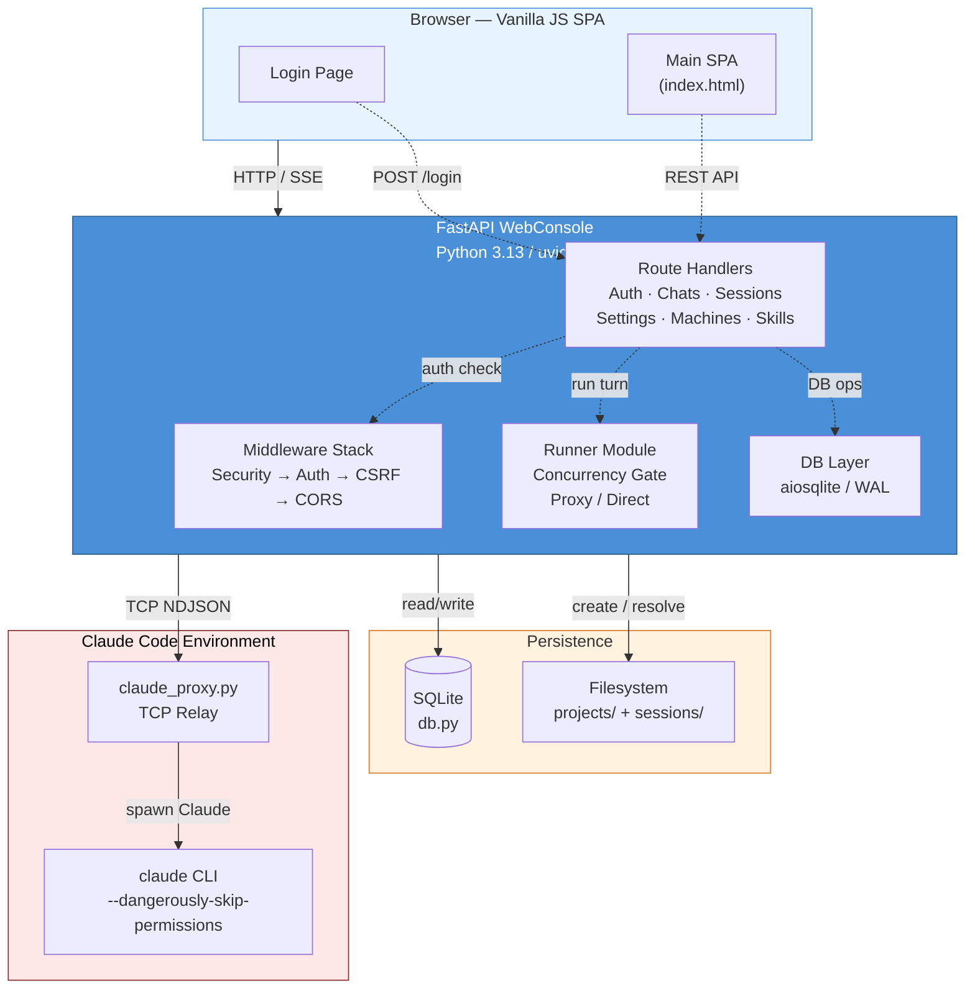

### 2.2 Request Processing Pipeline

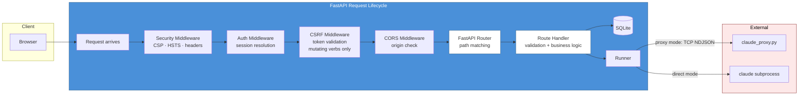

### 2.3 Concurrency Model

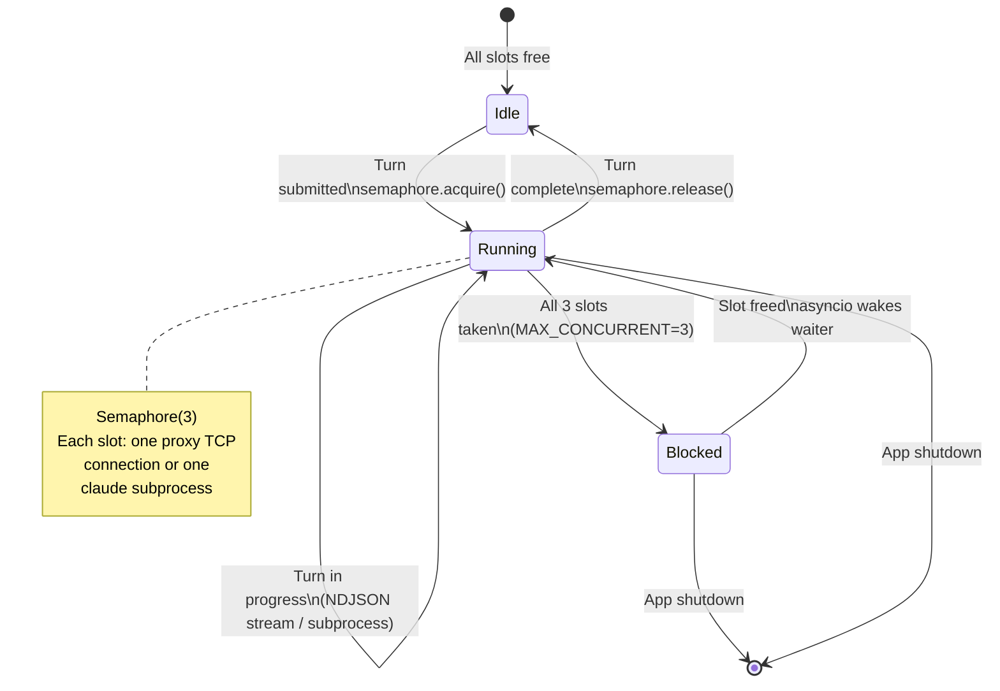

### 2.4 Data Storage Map

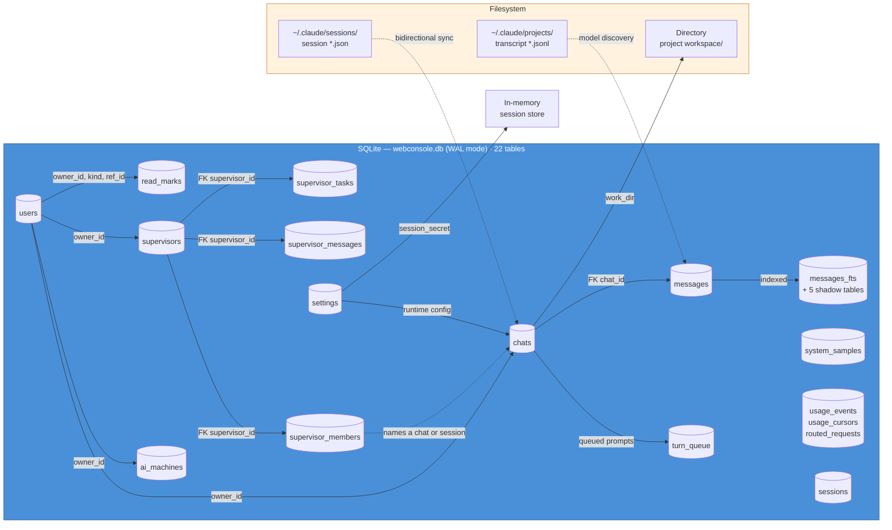

### 2.5 Orchestrator Run

How a prompt becomes a task graph and then a result. The engine is
`orchestrator.py`; everything below the dashed line runs in a background task the
request does not wait for.

```mermaid
sequenceDiagram
    autonumber
    participant U as Browser
    participant API as POST /api/supervisors/{id}/send
    participant E as SupervisorEngine
    participant P as PlanParser
    participant G as TaskGraph
    participant DB as SQLite
    participant R as runner / CLI

    U->>API: {prompt}
    API->>API: cap at PROMPT_MAX_CHARS
    API->>E: start_from_user_prompt()
    E->>E: spawn(_run_planner_turn)
    API-->>U: {status: "planning"} — returns immediately

    Note over E,R: background task; the HTTP request is already over
    E->>R: planner turn (backend's own model)
    R-->>E: plan text
    E->>P: parse(<<PLAN … >>)
    P-->>E: [ParsedTask]
    alt no tasks parsed
        E->>DB: _set_status("error") + planner reply
        Note right of E: an unparsable plan used to report<br/>"done" at 0% — a run that never ran
    else tasks parsed
        E->>G: add_task per task
        E->>DB: _set_status("running")
        loop until all_done()
            G-->>E: get_ready_tasks()
            E->>R: _execute_task(prompt, model)
            R-->>E: result
            E->>DB: task status + progress
        end
        E->>DB: _set_status(any_failed() ? "error" : "done")
    end
```

Three properties this diagram is meant to make obvious, each of which was once
false:

- **The request returns before any work happens.** Anything the caller needs to
  know afterwards arrives over `/stream`, not in the response.
- **`all_done()` counts `failed` as terminal.** When it did not, one failed task
  left the loop spinning at half-second intervals for ever.
- **Status is written to the database**, not only to the graph. The engine also
  updates a graph node named `"orchestrator"` that nothing creates, so those calls
  do nothing; `_set_status()` is what the interface actually reads.

### 2.6 Attention Feed — how a row becomes a highlight

`GET /api/orchestrator` answers one question: which agents are blocked on the
user. `classify_chat()` decides, per conversation, and the order of its branches
matters — a conversation can reach "waiting" by two different routes, and they
consult different dismissal marks.

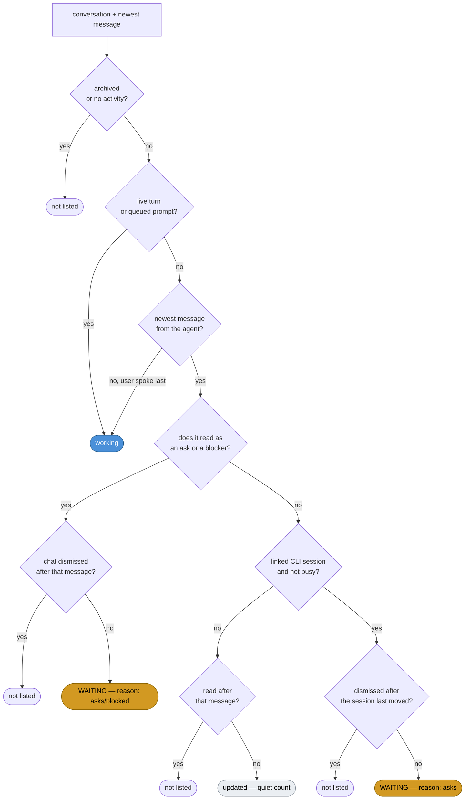

**The two `WAITING` outcomes are why dismissing a row was once impossible.** A
row reached by the right-hand route is rendered as a *conversation*, so the
dismiss control writes a `("chat", id)` mark — but that branch consulted only
the `("session", id)` mark, and additionally required a session status timestamp
that no non-busy session on this machine carries. The mark was written
faithfully and read by nothing. Both branches now take the later of the two
marks, and fall back to the conversation's own last activity when the session
carries no timestamp.

Dismissal is deliberately not permanent: `db.read_mark_set(dismiss=True)` writes
the same instant to `read_at` and `dismissed_at`, so the row leaves the feed
entirely, and any *later* ask raises it again. Opening a conversation marks it
read but never dismisses it — a question must not be retired by being glanced at.

### 2.7 Supervision and Recovery

Two long-lived processes, and what restarts each when it stops.

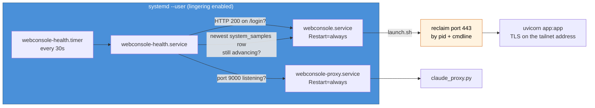

The health check asks two independent questions because the first alone was not
enough: a server whose write path had failed answered `/login` with 200 for
thirty-seven minutes while recording nothing. `system_samples` is the only table
written unconditionally on a timer, so silence in it — while the process is old
enough to have written one — is the honest signal that writes have stopped.

Port reclaim matches on the listening pid's command line, never on a pattern.
`pkill -f "uvicorn app:app"` matches every test server on the machine, and since
`launch.sh` runs on each restart, one restart swept them all.

### 2.8 Model Backend Routing — every path to `claude`

There is exactly one mechanism that reaches a model: spawn the `claude` CLI
with different arguments and environment. There is no second transport, no
SDK call, no direct HTTP client to a model provider anywhere in this codebase
— every route below ends at the same binary, configured differently. The
console reaches it through two competing spawn points; a terminal reaches it
through a third. All three resolve environment through the same pure function,
`backend_env.deltas`, so "which backend" is answered once and consumed three
times rather than reimplemented three times.

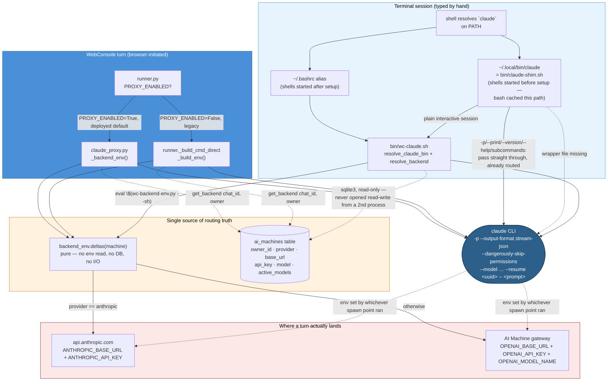

**Why the shim exists at all.** `~/.local/bin/claude` is not the CLI — it is
`bin/claude-shim.sh`. A shell's own alias table cannot be edited from outside
it, and a shell that was already running when the wrapper was installed keeps
whatever `claude` meant when it started. But bash caches the *resolved path*
of a command, not the alias, and `~/.local/bin` is first on `PATH` — so an
old shell picks up routing on its next invocation of `claude` without
re-reading anything. The shim passes non-interactive invocations (`-p`,
`--version`, subcommands) straight to the real binary, because those are
already configured by whichever spawn point launched them; routing them
through the wrapper too would add a database read to the turn hot path for no
benefit.

**Why the environment is deltas, not a finished dict.** Three callers need
the same answer in three different shapes — the proxy copies the whole
parent environment and applies deltas to it, the direct runner builds from an
allowlist and applies the same deltas, and the shell wrapper cannot replace
an interactive environment at all, only `export`/`unset` onto it. Only the
*removals* — dropping an inherited `ANTHROPIC_AUTH_TOKEN`, `ANTHROPIC_BASE_URL`,
or `CLAUDE_CODE_SIMPLE` left over from a previous backend — survive being
expressed all three ways, which is why `backend_env.deltas` exists as one
function instead of a rule copied by hand into three files (registry #68:
the copies disagreed, and a turn silently reached the wrong account).

**Credentials never appear on a command line.** `/proc/<pid>/cmdline` is
world-readable, so every environment-resolution path reads the API key from
the `ai_machines` table itself — `get_backend()` for the two console spawn
points, a direct `sqlite3` read (read-only, always) for the terminal wrapper
— rather than accepting it as an argument.

---

## 3. Component Breakdown

### 3.1 `app.py` — FastAPI Application (1370 lines)

The single entry point. Registers all routes, middleware, and endpoint handlers.

**Middleware stack**, outermost to innermost — which is the *reverse* of the
`add_middleware()` order in the source, because each call wraps the stack built
so far. Read the code bottom-up, or read this list:

1. **SecurityMiddleware** — Injects CSP (with per-request nonce), HSTS, X-Frame-Options, X-Content-Type-Options, Cache-Control on every response. Outermost, so it stamps headers on responses produced by everything below, including rejections.
2. **AuthMiddleware** — Resolves `wc_session` cookie to a session dict via `auth.session_get()`, attaches `request.state.session`. Blocks unauthenticated access to all routes except `/login`, `/assets/` and — currently — any path under `/dev/`.
3. **CsrfMiddleware** — Validates `X-CSRF-Token` header matches `wc_csrf` cookie on `POST`, `PUT`, `PATCH` and `DELETE`. `POST /login` is exempt (the session cookie itself is the CSRF guard). A `GET` is *not* covered, which is why a state-changing GET is unprotected by construction.
4. **CORSMiddleware** — Origins empty (deny-all), methods/headers wildcard.

Order matters for reasoning about failures: an unauthenticated request is
rejected by Auth **before** CSRF is ever consulted, so a missing token is not
the error such a request receives. This list previously read
`CORS → Security → CSRF → Auth`, which was the registration order with two
entries transposed, and inverted the Auth/CSRF relationship.

**Route groups:**

| Prefix | Method | Handler | Purpose |
|--------|--------|---------|---------|
| `/` | GET | `handle_index` | Serve main SPA |
| `/login` | GET | `handle_login_page` | Serve login page with CSP nonce |
| `/login` | POST | `handle_login` | Authenticate, set session + CSRF cookies |
| `/logout` | POST | `handle_logout` | Clear session cookie |
| `/assets/*` | — | `StaticFiles` | Serve JS/CSS/images |
| `/api/chats` | GET | `handle_chats_list` | List chats scoped to `owner_id` |
| `/api/chats` | POST | `handle_chat_create` | Create chat + workspace directory |
| `/api/chats/{id}` | GET | `handle_chat_get` | Chat metadata + full transcript |
| `/api/chats/{id}` | PATCH | `handle_chat_patch` | Rename, desc, archive, pin |
| `/api/chats/{id}` | DELETE | `handle_chat_delete` | Hard delete chat + messages |
| `/api/chats/{id}/export` | GET | `handle_chat_export` | Download Markdown transcript |
| `/api/chats/{id}/messages` | POST | `handle_submit_message` | Blocking turn (wait for full response) |
| `/api/chats/{id}/stream` | POST | `stream_handler` | Start a turn, then follow it over SSE |
| `/api/chats/{id}/live` | GET | `handle_chat_live` | Attach to a turn already running (`?since=<seq>`) |
| `/api/chats/{id}/stop` | POST | `handle_turn_stop` | Cancel the running turn and hold its queue |
| `/api/chats/{id}/queue` | GET | `handle_queue_list` | Prompts waiting behind the running turn |
| `/api/chats/{id}/queue/{qid}` | DELETE | `handle_queue_delete` | Discard a queued prompt |
| `/api/chats/{id}/queue/{qid}/release` | POST | `handle_queue_release` | Send a held prompt anyway |
| `/api/skills` | GET | `handle_skills_get` | List installed skills + active set |
| `/api/settings` | GET | `handle_settings_get` | Runtime config (non-secret) |
| `/api/settings` | PATCH | `handle_settings_patch` | Update runtime config + secrets |
| `/api/sessions` | GET | `handle_sessions_list` | CLI sessions + web chats for sidebar |
| `/api/sessions/{id}/resume` | POST | `handle_sessions_resume` | Create web chat from CLI session |
| `/api/machines` | GET | `handle_machines_list` | List AI machines (no keys) |
| `/api/machines` | POST | `handle_machine_create` | Create AI machine config |
| `/api/machines/{id}` | GET | `handle_machine_get` | Machine details |
| `/api/machines/{id}` | PATCH | `handle_machine_patch` | Update machine config |
| `/api/machines/{id}/activate` | POST | `handle_machine_activate` | Set active machine |
| `/api/machines/{id}/test` | POST | `handle_machine_test` | Connectivity test (with SSRF check) |
| `/api/machines/{id}` | DELETE | `handle_machine_delete` | Remove machine config |

**SSRF protection:**
- `_BLOCKED_NETS` — 17 private/reserved CIDRs (RFC 1918, CG-NAT, loopback, link-local, IETF, test-net, multicast, reserved, IPv6 equivalents).
- `_resolve_host()` — Resolves hostname to IP, checks against blocklist, used at outbound connection time (machine test, proxy).
- `_validate_host()` — Format-only check (hostname or IP pattern). Intentionally does NOT block private IPs at input time — allows configuration of `127.0.0.1` or `10.0.0.1` as valid hosts.

### 3.2 `runner.py` — Claude Code Invocation (737 lines)

Manages how prompts reach Claude Code. Two modes, two transport paths, each with blocking and streaming variants.

**Concurrency gate:** Singleton `asyncio.Semaphore(config.MAX_CONCURRENT)` (default 3). Every turn acquires it before proceeding.

**In-process state:**
- `_models_by_chat[chat_id]` — Last model reported by a blocking turn (consumed by `take_last_model()`).
- `_skills_by_session[session_id]` — Set of skill names observed during a streaming turn.

**Execution paths:**

```
run_turn() / stream_turn()
  │
  ├─ PROXY_ENABLED=True (default)
  │   ├─ _proxy_turn()          → _execute_proxy()  (blocking: collects then returns)
  │   └─ _proxy_stream_turn()   → _do_proxy_stream() (streaming: yields events)
  │
  └─ PROXY_ENABLED=False (legacy)
      ├─ _execute_direct()      (blocking: collects then returns)
      └─ _execute_direct_stream() (streaming: yields events)
```

**Proxy protocol (NDJSON over TCP):**
```
Runner → Proxy: {"type":"handshake","protocol":"webconsole-v1","token":"..."}
Proxy → Runner: {"type":"ack"}
Runner → Proxy: {"type":"turn","prompt":"...","session_id":"...","work_dir":"...","model":"..."}
Proxy → Runner: {"type":"session_id",...}  {"type":"model",...}  {"type":"skill",...}  {"type":"text",...}  {"type":"status",...}  {"type":"error",...}  {"type":"done"}
```

**Direct mode:** Spawns `claude -p <prompt> --output-format stream-json --verbose --dangerously-skip-permissions [--model <m>] -- [--resume|session-id <id>]`. Reads NDJSON from stdout, parses via `_normalise_cli_frame()`.

**NDJSON normalization** (`_normalise_cli_frame()`): Translates Claude's internal event shapes (system/api_retry, assistant, message, result, error) into a flat event list the runner and SSE handler both understand.

### 3.3 `auth.py` — Authentication (not shown in full, inferred from usage)

- **Password hashing:** Argon2id primary, scrypt fallback.
- **Session storage:** In-memory dict keyed by opaque session ID.
- **Session fixation protection:** New session + new CSRF token on every login.
- **CSRF tokens:** `_csrf_valid()` compares cookie token to header token.
- **Rate limiting:** `_login_attempts[ip]` tracks failures with bounded exponential backoff. 10 attempts per 5-minute window, then 30-second backoff.
- **Admin bootstrap:** `bootstrap_admin()` creates the first user from `WC_ADMIN_USER` / `WC_ADMIN_PASSWORD` env vars, then is idempotent.
- **Cookie helpers:** `set_session_cookie()`, `clear_session_cookie()` — HttpOnly, SameSite=Strict, Secure (unless `COOKIE_ALLOW_INSECURE`).

### 3.4 `db.py` — SQLite Persistence (747 lines)

Single SQLite file, async via `aiosqlite`, WAL mode, foreign keys enabled.

**Bootstrap:** `init()` creates all tables and runs additive migrations. `close()` shuts down.

**Settings table:** Key-value store for runtime configuration (secrets, models, timeouts, hosts). Loaded from DB into `config.py` at startup via `_load_settings_from_db()`.

**Chat CRUD:** `chat_list` (owner-scoped, sorted: unarchived → pinned → recency), `chat_get`, `chat_create`, `chat_update` (allowlist: title, description, archived, pinned), `chat_delete` (atomic transaction: messages + chats), `chat_archive`, `chat_set_session`, `chat_set_model`, `chat_set_title`.

**Messages:** `messages_get`, `messages_append`, `messages_batch` (atomic, uses asyncio.Lock to prevent race conditions).

**AI Machines:** `ai_machine_active`, `ai_machines_list`, `ai_machine_get`, `ai_machine_create`, `ai_machine_update`, `ai_machine_activate` (atomic deactivation of all others), `ai_machine_delete`.

**CLI Session Integration:**
- `read_claude_sessions()` — Scans `~/.claude/sessions/*.json`, filters active process, returns list of interactive sessions with model discovery.
- `write_claude_session_file()` — Writes session file for bidirectional sync (web → CLI). Atomic write (temp + rename). Path-traversal protection on session_id.
- `_extract_model_from_transcript()` — Scans `~/.claude/projects/*.jsonl` for assistant messages matching session_id, returns last non-synthetic model.
- `_lookup_session_model()` — In-process cache keyed by session_id.

### 3.5 `claude_proxy.py` — Host-Side TCP Proxy (419 lines)

Standalone server that bridges one authenticated TCP client to one Claude Code subprocess.

**Lifecycle per connection:**
1. Read handshake JSON, verify protocol + HMAC token.
2. Send ACK.
3. Wait for turn payload (300s timeout).
4. Launch Claude subprocess with resolved command.
5. Concurrent tasks: relay stdout → client, collect stderr, wait for process, wait for client disconnect.
6. Handle timeout/cancel/exit. Send done or error. Close connection.

**Claude normalization** (`normalise_claude_frame()`): Same frame translation as runner but also handles `tool_use` frames (extracts skill names).

**Fallback working directory:** If Docker-internal `work_dir` doesn't exist on host, falls back to `WC_PROXY_FALLBACK_DIR` (default `/tmp`).

### 3.6 `config.py` — Configuration (104 lines)

Environment-driven fail-fast config. All values from `os.environ` with defaults. Validates `SESSION_SECRET` (≥32 chars), `PROJECTS_ROOT` (non-empty), `PROXY_TOKEN` (≥32 chars when proxy mode).

Key settings:
| Setting | Default | Description |
|---------|---------|-------------|
| `HOST` / `LISTEN_HOST` | `127.0.0.1` | Bind address |
| `PORT` | `8080` | Web port |
| `DB_PATH` | `./data/webconsole.db` | SQLite file |
| `PROJECTS_ROOT` | `./projects` | Workspace root |
| `PROXY_ENABLED` | `True` | Use proxy mode |
| `PROXY_HOST` / `PROXY_PORT` | `127.0.0.1:9000` | Proxy target |
| `MAX_CONCURRENT` | `3` | Claude processes |
| `TURN_TIMEOUT_S` | `300` | Per-turn wall-clock |
| `PROMPT_MAX_CHARS` | `8000` | Prompt length cap |
| `SESSION_TTL_S` | `7200` | Absolute session TTL |
| `SESSION_IDLE_S` | `1800` | Idle timeout |
| `SESSION_MAX` | `50` | Hard cap |

### 3.7 Web Frontend (5 files, ~65 KB)

| File | Size | Purpose |
|------|------|---------|
| `web/index.html` | ~10 KB | Main SPA shell (sidebar + chat area + settings/machines tabs) |
| `web/login.html` | ~5 KB | Login page with CSP nonce injection |
| `web/assets/app.js` | ~28 KB | Core: auth flow, API layer, chat CRUD, SSE streaming, skills, settings, machine management |
| `web/assets/chat-list.js` | ~8 KB | Sidebar chat list: create, pin, archive, resume CLI sessions, model selector |
| `web/assets/conversation.js` | ~10 KB | Message rendering, markdown, export, model dropdown per-chat |
| `web/assets/styles.css` | ~5.8 KB | Full stylesheet (light/dark theme variables, responsive layout) |
| `web/assets/api.js` | ~61 B | `escapeHtml()`, fetch wrapper with CSRF token injection |
| `web/assets/favicon.svg` | ~400 B | Favicon |

**Security patterns in client JS:**
- Single `escapeHtml()` function for XSS mitigation — all interpolated values escaped.
- SSE streams are torn down with `EventSource.close()`, and the handle is held
  for that purpose. **Not `AbortController`:** `EventSource`'s init dictionary
  accepts only `withCredentials`, so a `signal` member is silently ignored and
  `abort()` does nothing to the stream. This document previously claimed the
  opposite, and the orchestrator page was written to match the claim — every
  switch leaked a live stream until it was measured in a browser (`readyState`
  stayed `1` after `abort()`, and reached `2` only after `close()`).
- No `eval()`, no inline event handlers.
- CSRF token injected from `wc_csrf` cookie on every mutating request.

### 3.8 `orchestrator.py` — Orchestration Engine (955 lines)

Decomposes a prompt into a task graph and runs it. Imported by `app.py`; imports
`db` lazily inside functions to avoid a cycle.

| Component | Responsibility |
|-----------|----------------|
| `PlanParser` | Extracts `ParsedTask`s from a `<<PLAN … >>` block. Tolerates `<<PLAN` and `<<PLAN>>`, because the system prompt and the request text disagreed and a model obeying either produced a block the parser could not find. |
| `ModelRouter` | Picks a model per task from configurable regex rules, with a complexity score as the fallback signal. |
| `TaskGraph` | The DAG. `get_ready_tasks()` returns only runnable ids; `all_done()` treats `done`, `blocked` **and `failed`** as terminal, so a failed task ends the run rather than spinning the scheduler; `any_failed()` decides whether that end was a success. |
| `ProgressTracker` | Recent events and aggregate progress for the SSE stream. |
| `SupervisorEngine` | Owns the run: `start_from_user_prompt()`, `run_schedule_loop()`, `_execute_task()`. |

**Two lifecycle rules worth knowing before editing it:**

- Background work goes through `SupervisorEngine.spawn()`, never a bare
  `asyncio.create_task()`. The loop keeps only weak references to tasks, so an
  unheld task can be collected mid-run; `spawn()` holds a reference, releases it
  on completion, and logs any exception rather than leaving it as asyncio's
  "Task exception was never retrieved".
- Overall status goes through `_set_status()`, which writes to the database.
  The engine also updates a graph node named `"orchestrator"`, but nothing creates
  such a node — the only `add_task()` call inserts parsed plan tasks — so those
  updates are no-ops kept for the case where one exists. The database write is
  the part the interface reads.

### 3.9 `sysstats.py` — Host Sampling (458 lines)

Reads `/proc` for CPU, memory, swap, disk, load and this process's own resident
size; samples on a timer into `system_samples` so history accumulates while
nobody is watching. Linux-only by construction, and reports
`available: false` rather than failing where `/proc` cannot be read.

Also provides the write-health probe used by `bin/wc-health.sh`:
`newest_sample_at()` opens the database `mode=ro` so the check cannot itself
write, and `write_health()` returns one of `ok` / `warming` / `stale` /
`unknown` rather than a boolean — `warming` exists because a just-restarted
server inherits old rows, and a boolean check would restart it, then restart it
again.

---

## 4. Data Flows

### 4.1 Chat Creation

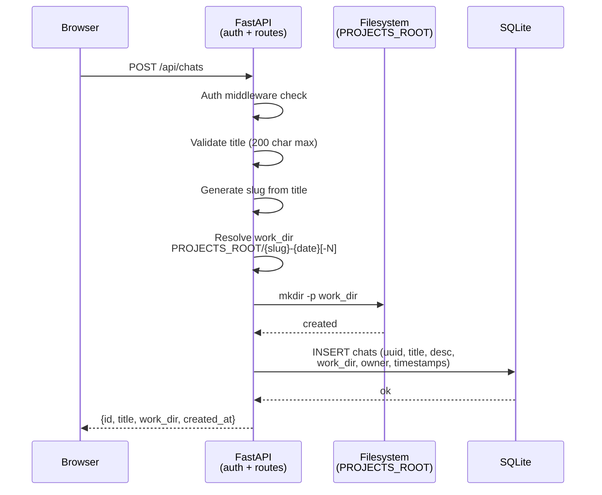

### 4.2 Message Submission — Blocking Mode

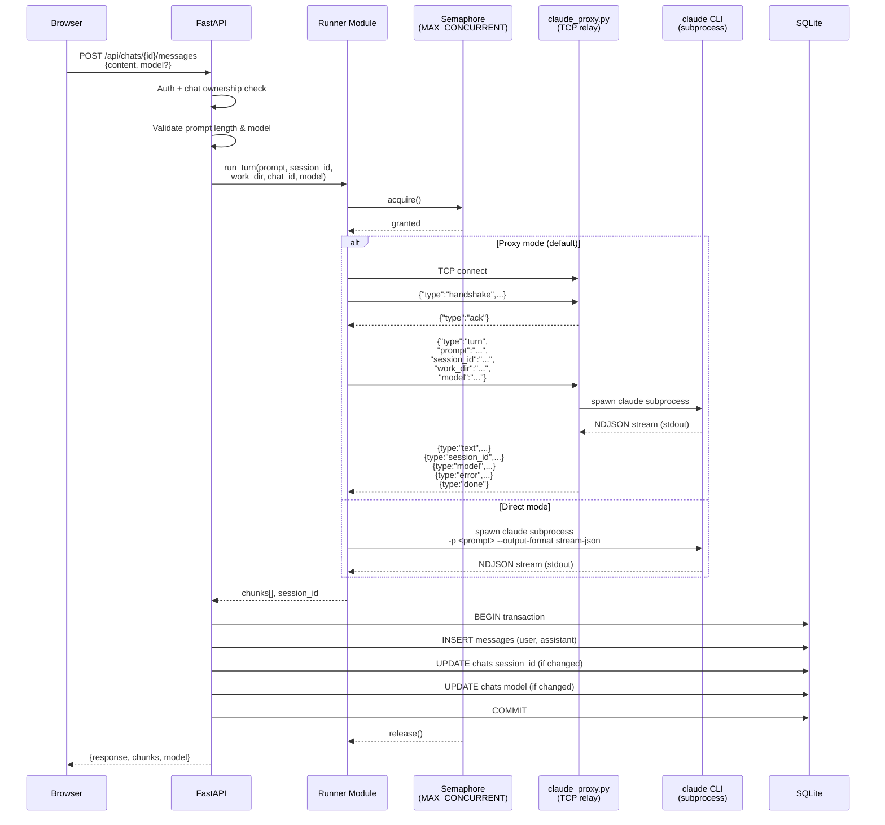

### 4.3 Message Submission — SSE Streaming Mode

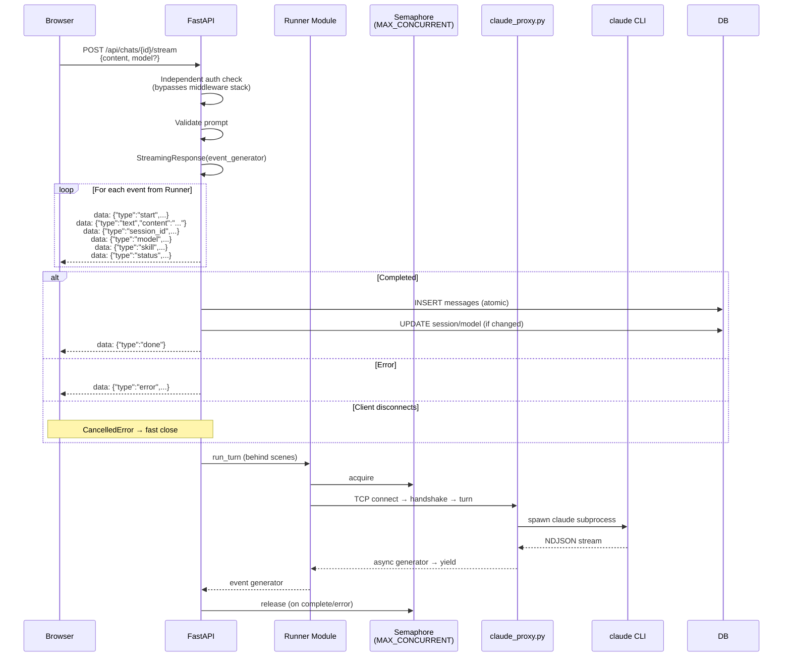

### 4.4 CLI Session Discovery and Resume

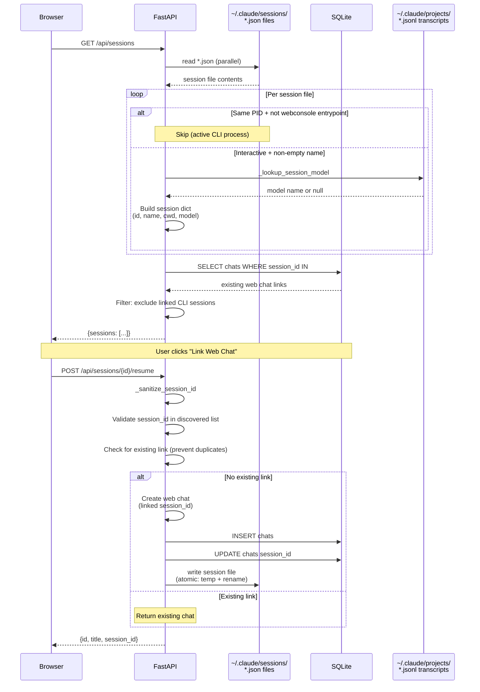

### 4.5 Settings Update with SSRF Protection

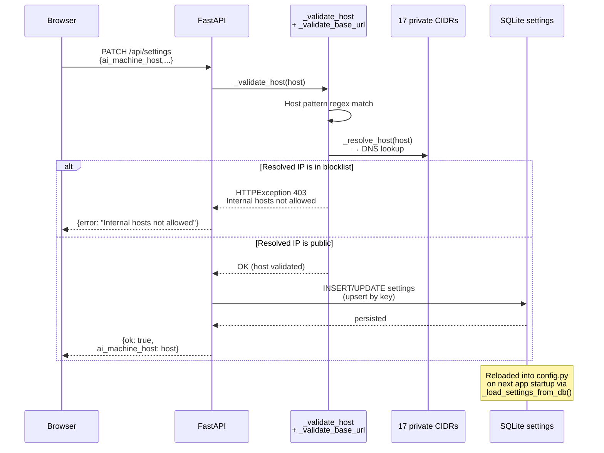

### 4.6 Login and Session Lifecycle

```mermaid
sequenceDiagram
    participant Browser
    participant App as FastAPI
    participant DB as SQLite
    participant Auth as auth module<br/>(sessions + rate limit)

    Browser->>App: POST /login {username, password}
    App->>Auth: login_attempt_flood(ip)
    alt Rate limited (11th failure)
        Auth-->>App: True (backoff required)
        App-->>Browser: 429 + Retry-After header
    else Within limit
        Auth-->>App: False
        App->>DB: SELECT users WHERE name = ?
        DB-->>App: user record or null
        App->>App: verify_password(password, hash)
        alt Invalid credentials
            App->>Auth: login_record_failure(ip)
            App-->>Browser: 401 {error: "Invalid credentials"}
        else Valid
            App->>Auth: session_new(user_name) → sid, csrf
            Auth->>Auth: Store session (sid → {user, created})
            Auth->>Auth: login_record_success(ip)
            App-->>Browser: 200 {ok: true}<br/>Set-Cookie: wc_session=sid<br/>Set-Cookie: wc_csrf=csrf
        end
    end

    Note over Browser,DB: Subsequent requests include cookies

    Browser->>App: GET /api/chats<br/>(with cookies)
    App->>App: AuthMiddleware<br/>resolve wc_session → session dict
    App->>DB: SELECT chats WHERE owner_id = ?
    DB-->>App: chat list
    App-->>Browser: {chats: [...]}

    Browser->>App: POST /logout
    App->>Auth: session_drop(sid)
    Auth->>Auth: Delete session from memory
    App-->>Browser: 200 {ok: true}<br/>Set-Cookie: wc_session=; Max-Age=0
```

---

## 5. Database Schema

```sql
CREATE TABLE chats (
    id            TEXT PRIMARY KEY,        -- uuid4 hex
    title         TEXT NOT NULL,
    description   TEXT,
    session_id    TEXT,                    -- linked CLI session or Claude session
    work_dir      TEXT NOT NULL,           -- absolute path to workspace
    owner_id      TEXT NOT NULL DEFAULT 'admin',
    created_at    TEXT NOT NULL,           -- ISO 8601 UTC
    updated_at    TEXT NOT NULL DEFAULT '',
    archived      INTEGER NOT NULL DEFAULT 0,
    pinned        INTEGER NOT NULL DEFAULT 0,
    pinned_at     TEXT,                    -- ISO 8601 UTC
    deleted_at    TEXT,                    -- soft delete marker
    model         TEXT,                    -- last discovered model for this chat
    ai_machine_id TEXT                     -- routing to multi-AI machine
);

CREATE TABLE messages (
    id         INTEGER PRIMARY KEY AUTOINCREMENT,
    chat_id    TEXT NOT NULL REFERENCES chats(id),
    role       TEXT NOT NULL,             -- 'user' | 'assistant' | 'system'
    content    TEXT NOT NULL,
    created_at TEXT NOT NULL
);
CREATE INDEX idx_messages_chat ON messages(chat_id, id);

CREATE TABLE users (
    id       TEXT PRIMARY KEY,            -- uuid4 hex
    email    TEXT,
    name     TEXT NOT NULL,
    password TEXT NOT NULL,               -- Argon2id or scrypt hash
    role     TEXT NOT NULL DEFAULT 'admin',
    created_at TEXT NOT NULL DEFAULT ''
);

CREATE TABLE settings (
    key        TEXT PRIMARY KEY,          -- 'session_secret', 'default_model', etc.
    value      TEXT NOT NULL,
    updated_at TEXT NOT NULL
);

CREATE TABLE ai_machines (
    id            TEXT PRIMARY KEY,
    name          TEXT NOT NULL,
    host          TEXT NOT NULL,
    port          INTEGER NOT NULL DEFAULT 9000,
    api_key       TEXT,                    -- stored plaintext (user-managed)
    model         TEXT NOT NULL DEFAULT 'claude-sonnet-5',
    base_url      TEXT,                    -- e.g. http://host:11434/v1
    description   TEXT,
    active        INTEGER NOT NULL DEFAULT 0,
    owner_id      TEXT NOT NULL DEFAULT 'admin',
    created_at    TEXT NOT NULL,
    updated_at    TEXT NOT NULL
);
```

**Pragmas:** `journal_mode=WAL`, `foreign_keys=ON`.

**Additive migrations** applied at startup on `chats` and `ai_machines` tables (pinned, pinned_at, deleted_at, model, ai_machine_id, owner_id).

---

## 6. API Reference

### Auth

| Method | Path | Auth | Body | Response |
|--------|------|------|------|----------|
| POST | `/login` | No | `{username, password}` | `{ok: true}` + cookies |
| POST | `/logout` | Yes | — | `{ok: true}` |

### Chats

| Method | Path | Auth | Body | Response |
|--------|------|------|------|----------|
| GET | `/api/chats` | Yes | — | `{chats: [{id, title, description, work_dir, created_at, updated_at, archived, pinned, pinned_at, session_id, model}]}` |
| POST | `/api/chats` | Yes | `{title?, description?}` | `{id, title, work_dir, created_at}` |
| GET | `/api/chats/{id}` | Yes | — | `{chat: {...}, messages: [{role, content, created_at}]}` |
| PATCH | `/api/chats/{id}` | Yes | `{title?, description?, archived?, pinned?}` | `{ok: true}` |
| DELETE | `/api/chats/{id}` | Yes | — | `{ok: true}` |
| GET | `/api/chats/{id}/export` | Yes | — | Markdown file attachment |
| POST | `/api/chats/{id}/messages` | Yes | `{content, model?}` | `{response, chunks, model}` |
| POST | `/api/chats/{id}/stream` | Yes | `{content, model?}` | SSE stream |

### Sessions

| Method | Path | Auth | Body | Response |
|--------|------|------|------|----------|
| GET | `/api/sessions` | Yes | — | `{sessions: [{id, name, cwd, kind, startedAt, updatedAt, sessionId, model, webchat?}]}` |
| POST | `/api/sessions/{id}/resume` | Yes | — | `{id, title, session_id}` |

### Skills

| Method | Path | Auth | Query | Response |
|--------|------|------|-------|----------|
| GET | `/api/skills` | Yes | `chat_id?` or `session_id?` | `{skills: [{name, description, installed, active}], session_id}` |

### Settings

| Method | Path | Auth | Body | Response |
|--------|------|------|------|----------|
| GET | `/api/settings` | Yes | — | `{ai_machine_host, ai_machine_port, proxy_enabled, default_model, fallback_model, version, session_ttl_s, turn_timeout_s, prompt_max}` |
| PATCH | `/api/settings` | Yes | `{ai_machine_host?, session_secret?, projects_root?, proxy_token?, model_base_url?, model_api_key?, model_name?, default_model?, fallback_model?, session_ttl?, turn_timeout?, prompt_max?}` | `{ok: true, ai_machine_host}` |

### Machines

| Method | Path | Auth | Body | Response |
|--------|------|------|------|----------|
| GET | `/api/machines` | Yes | — | `{machines: [{id, name, host, port, model, base_url, description, active, created_at, updated_at}]}` |
| POST | `/api/machines` | Yes | `{name, host, port?, api_key?, model?, base_url?, description?}` | `{ok: true, id, name}` |
| GET | `/api/machines/{id}` | Yes | — | `{machine: {...}, has_api_key: bool}` |
| PATCH | `/api/machines/{id}` | Yes | `{name?, host?, port?, api_key?, model?, base_url?, description?}` | `{ok: true}` |
| POST | `/api/machines/{id}/activate` | Yes | — | `{ok: true, activated: bool}` |
| POST | `/api/machines/{id}/test` | Yes | — | `{ok: bool, status: reachable\|unreachable, error?}` |
| DELETE | `/api/machines/{id}` | Yes | — | `{ok: true}` |

### Orchestrator — attention feed

Which agents are blocked on the user. Distinct from the orchestration API below
despite the near-identical prefix: this is a read-only view over conversations
and CLI sessions, and owns no state of its own beyond read marks.

| Method | Path | Auth | Body | Response |
|--------|------|------|------|----------|
| GET | `/api/orchestrator` | Yes | — | `{waiting: [...], working: [...], updated: [...]}` |
| POST | `/api/orchestrator/read` | Yes | `{kind, id, dismiss?}` or `{all: true}` | `{ok: true, read_at}` |

`dismiss: true` writes the same timestamp to `read_at` and `dismissed_at`, which
silences an unanswered question; reading alone never does. `kind` is `chat` or
`session` — a row shown as a conversation is dismissed under `chat` even when
its waiting status is derived from a linked CLI session.

### Orchestrator — orchestration

A orchestrator decomposes a prompt into a task graph and runs the tasks. State
lives in `supervisors`, `supervisor_tasks` and `supervisor_messages`; the engine
is `orchestrator.py`.

| Method | Path | Auth | Body | Response |
|--------|------|------|------|----------|
| GET | `/api/supervisors` | Yes | — | `{supervisors: [{id, title, description, status, progress_pct, ...}]}` |
| POST | `/api/supervisors` | Yes | `{title?, description?, config?}` | `{ok: true, id, title, status}` |
| GET | `/api/supervisors/{id}` | Yes | — | `{orchestrator: {...}}` |
| PATCH | `/api/supervisors/{id}` | Yes | `{title?, description?, status?, config?}` | `{ok: true}` |
| DELETE | `/api/supervisors/{id}` | Yes | — | `{ok: true}` |
| POST | `/api/supervisors/{id}/send` | Yes | `{prompt}` | `{ok: true, supervisor_id, status}` |
| POST | `/api/supervisors/{id}/pause` | Yes | — | `{ok: true}` |
| POST | `/api/supervisors/{id}/resume` | Yes | — | `{ok: true}` |
| GET | `/api/supervisors/{id}/messages` | Yes | — | `{messages: [{id, role, content, metadata, created_at}]}` |
| GET | `/api/supervisors/{id}/tasks` | Yes | — | `{tasks: [{id, title, status, progress_pct, model, depends_on}]}` |
| GET | `/api/supervisors/{id}/stream` | Yes | — | SSE: progress, status, task and message events |
| GET | `/api/supervisors/{id}/tasks/{task_id}/stream` | Yes | — | SSE for one task |
| GET | `/api/supervisors/{id}/members` | Yes | — | `{members: [{kind, id, title, status, last_seen}]}` |
| POST | `/api/supervisors/{id}/members` | Yes | `{members: [{kind, id}]}` | `{ok: true, added, skipped}` |
| DELETE | `/api/supervisors/{id}/members/{chat_id}` | Yes | — | `{ok: true}` |

`/send` is capped at `PROMPT_MAX_CHARS`, the same limit the chat endpoints
enforce — it had none until the cap was added, so a prompt refused by a
conversation was accepted here.

### Host statistics

| Method | Path | Auth | Body | Response |
|--------|------|------|------|----------|
| GET | `/api/system` | Yes | — | Live snapshot: `{cpu_pct, mem_*, disk, swap_*, load, proc, uptime_s, info}` |
| GET | `/api/system/series?days&bucket` | Yes | — | `{series: [...], bucket, days, sample_interval_s, retention_days}` |

Readable by any authenticated user, matching `/api/settings`: the values carry
no secret, and an operator checking whether the box is struggling should not
need an admin account. Buckets are the same set the usage series uses, grouped
in **local time** — see §5.

---

## 7. Security Model

### Trust Boundaries

WebConsole **is not a sandbox**. Claude Code runs with `--dangerously-skip-permissions` and full OS privileges of the process user. Any authenticated user can execute arbitrary commands and file operations. The security model is:

1. **Network isolation** — bind to loopback or Tailscale private IP only. Never expose to public internet.
2. **Authentication** — Argon2id passwords, HttpOnly/Strict cookies, rate-limited login with backoff.
3. **CSRF** — dual-token (cookie + header) on all mutating endpoints.
4. **SSRF** — 17 blocked CIDRs validated at DNS resolution time for outbound connections.
5. **Input validation** — prompt length cap, model name regex, hostname pattern, path traversal guards, parameterized SQL.
6. **XSS prevention** — `escapeHtml()` on all client-side DOM insertion, CSP with nonce, no inline handlers.
7. **Least privilege** — Docker image runs as non-root `appuser`.

### Threat Matrix

| Threat | Source | Sink | Mitigation |
|--------|--------|------|------------|
| RCE via subprocess | User prompt | `asyncio.create_subprocess_exec` | Arg list only, no shell, length cap |
| Path traversal | Chat title | `Path.mkdir()` under PROJECTS_ROOT | `slug_pattern` + `is_relative_to` at launch |
| SQL injection | Any user input | SQLite queries | Parameterized `?` placeholders |
| Session fixation | Unknown cookie | `session_get()` | New session + CSRF on login |
| Prompt injection | User → Claude | Subprocess `-p` flag | No additional execution layer |
| XSS | DB content → HTML | `innerHTML` | `escapeHtml()` before render |
| Directory enumeration | Chat ID guesser | `chat_get()` | Owner scoping on all queries |
| SSE bypass | Unauthenticated | `stream_handler` | Independent cookie check in handler |

### Secrets

- `WC_SESSION_SECRET` — 32+ char random string for session encryption. Generated via `secrets.token_urlsafe(32)`.
- `WC_PROXY_TOKEN` — 32+ char random string for proxy authentication. HMAC-compared via `hmac.compare_digest()`.
- `WC_ADMIN_PASSWORD` — Bootstrap password, hashed with Argon2id.
- `WC_DB_PATH` — SQLite file path (not a secret, but should not be world-readable).
- `.env` files are gitignored. `.env.example` contains placeholders only.
- API keys for external AI machines are stored plaintext in the settings table (user-managed; not encrypted at rest).

---

## 8. Configuration

All configuration comes from environment variables with `WC_` prefix. The `.env` file is loaded via `python-dotenv`.

### Required

| Variable | Generated | Purpose |
|----------|-----------|---------|
| `WC_SESSION_SECRET` | `secrets.token_urlsafe(32)` | Session encryption |
| `WC_ADMIN_PASSWORD` | User-chosen | Bootstrap admin password |
| `WC_PROJECTS_ROOT` | User-specified | Workspace directory root |
| `WC_DB_PATH` | User-specified | SQLite database path |
| `WC_PROXY_TOKEN` | `secrets.token_urlsafe(32)` | Proxy auth token (proxy mode) |

### Optional (with defaults)

| Variable | Default | Purpose |
|----------|---------|---------|
| `WC_LISTEN_HOST` | `127.0.0.1` | Web bind address |
| `WC_PORT` | `8080` | Web port |
| `WC_PROXY_ENABLED` | `1` | Enable proxy mode |
| `WC_PROXY_HOST` | `127.0.0.1` | Proxy target host |
| `WC_PROXY_PORT` | `9000` | Proxy target port |
| `WC_PROXY_CONNECT_TIMEOUT_S` | `10` | Proxy connection timeout |
| `WC_PROXY_TURN_TIMEOUT_S` | `300` | Proxy turn timeout |
| `WC_MAX_CONCURRENT` | `3` | Max concurrent Claude processes |
| `WC_TURN_TIMEOUT_S` | `300` | Direct mode turn timeout |
| `WC_PROMPT_MAX_CHARS` | `8000` | Prompt length limit |
| `WC_SESSION_TTL_S` | `7200` | Absolute session TTL |
| `WC_SESSION_IDLE_S` | `1800` | Idle session TTL |
| `WC_SESSION_MAX` | `50` | Hard session cap |
| `WC_COOKIE_ALLOW_INSECURE` | `0` | Allow cookies over plain HTTP |

### Runtime Settings (stored in DB, modifiable via API)

These persist across restarts and override config.py defaults:
- `default_model`, `fallback_model` — Model selection
- `session_ttl`, `turn_timeout`, `prompt_max` — Runtime limits
- `ai_machine_host` — Active proxy host
- `session_secret`, `projects_root`, `proxy_token`, `model_base_url`, `model_api_key`, `model_name`, `cookie_allow_insecure` — Secrets and config

---

## 9. File Inventory

```
claude-code-webconsole/
├── db.py                   3600  SQLite: schema, CRUD, migrations, CLI sync
├── app.py                  463   FastAPI app, entry point, middleware, route registration
├── transcripts.py          1678  Read and parse Claude CLI transcripts
├── orchestrator.py           1134  Orchestration: plan parsing, task graph, scheduler
├── runner.py               1031  Claude Code invocation (direct + proxy)
├── prompts.py               788  Detect and answer a CLI permission prompt
├── classification.py        718  Attention: which conversations need a person, and why
├── claude_proxy.py          667  Host-side TCP proxy to Claude Code
├── auth.py                  477  Auth: passwords, sessions, CSRF, rate-limit, tokens
├── sysstats.py              458  Host sampling from /proc + write-health probe
├── turns.py                 380  Turn lifecycle: a turn outlives its request
├── routes/misc.py          1278  Settings, sessions, skills, health, orchestrator feed
├── net_validation.py        232  Outbound address validation (SSRF guard)
├── middleware.py            207  The three middleware classes and the API-token session
├── config.py                185  Env-driven config with validation
├── launch.sh                203  Start with TLS on the tailnet address
├── start.sh                  31  Thin wrapper around launch.sh
├── logging.conf              84  Rotating file handler; path from config.LOG_FILE
├── requirements.txt          13  Pinned runtime dependencies
├── requirements-dev.txt      15  Dev + security tooling
├── CHANGELOG.md            1862  Operator-facing record; see §15a of rules.md
├── ARCHITECTURE.md        ~1400  This document
├── rules.md                 943  Build/release pipeline (gitignored, not shipped)
├── docs/threat-model.md     841  Dated attacker analysis (see its currency note)
├── README.md                255  User documentation
├── Backend_Models_...md     249  Model comparison, 2026-09-02
├── SECURITY.md               74  Security policy + deployment requirements
├── TODO.md                   37  Outstanding work
├── LICENSE                        Proprietary
├── .gitignore  .bandit  .gitleaks.toml
├── .githooks/pre-push             gitleaks scan, runs on push
├── .github/workflows/             CI + dependabot
├── bin/                    3280  18 scripts: release, health, proxy run, API tokens,
│                                 chunked suite runner, transcript doctor, model benchmarks,
│                                 livecheck, wc-claude, and others
├── systemd/                       --user units: app, proxy, health service + timer
├── docker/Dockerfile              Container image (non-root user)
├── docs/superpowers/              Design specs and implementation plans
├── .env                           Local secrets (gitignored)
├── .env.example              62   Config template (committed)
├── web/                    8489  Vanilla-JS SPA; no framework, no build step
│   ├── orchestrator.html      1095  Orchestrator page markup
│   ├── index.html            304  Main SPA
│   ├── login.html             81  Login page
│   └── assets/
│       ├── app.js           3021  Core: auth, API, chat, SSE, settings, machines
│       ├── conversation.js  1019  Message render, drafts, stream lifecycle
│       ├── chat-list.js      812  Sidebar: groups, highlights, dismiss, "?" mark
│       ├── styles.css        583  Full stylesheet (light/dark theme)
│       ├── transcript.js     567  CLI transcript viewer
│       ├── stats.js          404  Charts shared by the usage and server pages
│       ├── server.js         285  Server statistics rendering
│       ├── api.js             61  escapeHtml + fetch wrapper with CSRF
│       ├── login.js           54  Login page
│       ├── favicon.svg
│       └── orchestrator/      1881  Ten ES modules, split from the old
│           ├── list.js       324  single-file orchestrator.js in 0.10.0.
│           ├── main.js       302  Loaded as `type="module"`; entry is main.js.
│           ├── members.js    275
│           ├── tasks.js      241
│           ├── layout.js     226
│           ├── stream.js     195
│           ├── banners.js    113
│           ├── api.js         94
│           ├── state.js       70
│           └── dom.js         41
├── routes/                4513  Four route modules extracted from app.py in 0.10.3
│   ├── chats.py            1704  Chat CRUD, turns, questions, transcript, streaming
│   ├── misc.py             1278  Settings, sessions, skills, health, orchestrator feed
│   ├── supervisors.py       860  Orchestrator orchestration routes
│   └── machines.py           665  AI machine CRUD and connectivity tests
├── tests/                 39825  109 files, 2481 collected cases
│   ├── conftest.py                Capability guard: aborts a partial or blind run
│   ├── capabilities.py            quickjs + playwright driver detection
│   └── test_qa_*.py               The QA layer, ~94 suites
├── data/                          SQLite database, WAL/SHM, and the session-secret
│                                  and proxy-token files launch.sh manages. All
│                                  gitignored; none are ever committed.
└── projects/                      Per-conversation workspaces (created at runtime)
```

---

## 10. Deployment Options

### Option A: Direct mode (single machine)

```bash
export WC_PROXY_ENABLED=0
export WC_PROJECTS_ROOT=$HOME/projects
export WC_DB_PATH=$HOME/.local/share/webconsole/webconsole.db
python3 app.py
```

Best for: laptop development, single-machine setup, no Claude Code proxy needed.

### Option B: Proxy mode (containerized FastAPI, host Claude)

```bash
# Host side — run proxy
WC_PROXY_TOKEN="$(python3 -c 'import secrets; print(secrets.token_urlsafe(32))')" \
python3 claude_proxy.py

# Container side
docker run -d \
  -e WC_SESSION_SECRET="$(python3 -c 'import secrets; print(secrets.token_urlsafe(32))')" \
  -e WC_ADMIN_PASSWORD='strong-password' \
  -e WC_PROXY_ENABLED=1 \
  -e WC_PROXY_HOST=host.docker.internal \
  -e WC_PROXY_PORT=9000 \
  -e WC_PROXY_TOKEN='<same token>' \
  -e WC_PROJECTS_ROOT=/projects \
  -e WC_DB_PATH=/data/webconsole.db \
  -v wc-data:/data \
  -v wc-projects:/projects \
  claude-code-webconsole
```

Best for: production, Docker deployment, network isolation between app and Claude.

### Option C: Tailscale remote access

```bash
export WC_LISTEN_HOST=100.x.x.x   # Tailscale tailnet IP
export WC_COOKIE_ALLOW_INSECURE=1  # plain HTTP on trusted tailnet
python3 app.py
```

Access from authorized tailnet devices. Enforce tailnet ACLs.

### Docker Image

```bash
docker build -f docker/Dockerfile -t claude-code-webconsole .
```

Image includes: FastAPI app only. Expects external proxy or mounted Claude binary for direct mode. Runtime data in `/data` and `/projects` volumes. Runs as non-root `appuser`.

---

## 11. Testing Strategy

Five test files covering the full QA pyramid, 159+ tests total.

| Layer | File | What it covers |
|-------|------|----------------|
| **Unit** | `test_db.py`, `test_functional.py` | Pure helpers, slug generation, command construction, environment filtering, frame normalization |
| **Auth** | (within tests) | Password hashing, session lifecycle, CSRF validation, rate limiting boundaries |
| **Integration** | `test_db.py`, `test_functional.py` | SQLite CRUD, ownership isolation, message batching, CLI session-file sync |
| **Component/API** | `test_app.py` | Route contracts, validation, auth boundaries, handler behavior with mocked runner/proxy |
| **System/E2E** | `test_app.py` | Full create → submit → persist → reload flow with fake Claude turn |
| **UAT** | `test_qa_layers.py` | CLI-session resume, chat export, sidebar visibility, cross-user privacy |
| **Security** | `test_frontend.py`, `test_model_settings.py` | XSS sinks, CSP compliance, model validation, settings boundaries |

**Security scanning:** Bandit (ll), Ruff, pip-audit, safety, Gitleaks (pre-push), Trivy (Docker image).

---

## 12. Development Workflow

### Build Pipeline (`rules.md`)

20-stage pipeline: zombie cleanup → version check → compile → security passes (RCE, path traversal, SQL injection, OWASP, XSS) → dependency check → SQLite integrity → auth smoke → security audit → hardening linters → client lint → code review → SPA standards → E2E smoke → dependency install → docs sweep → bug watch → deploy smoke → concurrency audit → cookie audit → verdict.

### Pre-push

```bash
git config core.hooksPath .githooks
# Runs gitleaks to prevent credential commits
```

### Local dev

```bash
python3 -m venv .venv
. .venv/bin/activate
pip install -r requirements.txt
pip install -r requirements-dev.txt
cp .env.example .env   # edit with your secrets
python3 app.py
```

### Test suite

```bash
python3 -m unittest discover -s . -p 'test*.py' -v
python3 -m pytest test_qa_layers.py -v
bandit -r . -x __pycache__ -ll
ruff check app.py auth.py config.py db.py runner.py tests
```

---

## 13. Code Size and Composition

Measured on 2026-09-02 at `WebConsole_0.10.2`. Per-file counts are in §9; this
chapter is the shape those numbers make.

| Layer | Lines | Share of code |
|---|---:|---:|
| Tests (`tests/`, 109 files, 2,481 cases) | 39,825 | 59% |
| Server (root `*.py` + `routes/`, 21 modules) | 15,864 | 24% |
| Client (`web/`, 22 files) | 8,489 | 13% |
| Tooling (`bin/`, 18 scripts) | 3,280 | 5% |
| **Total code** | **67,458** | |
| Documentation (Markdown) | 4,514 | — |

Excluded: `.venv/` (281 MB), `.git/`, `data/`, `logs/`, and the `__pycache__` /
`.*_cache` directories. Two counted files are absent from a clone — `rules.md`
(943) and `scratch_qdiag.py` (102) are gitignored — so a fresh checkout is about
1,045 lines smaller than a working tree.

### Test-to-code ratio: 1.44 : 1

38,312 lines of tests against 26,644 of server and client. Deliberately high: the
suites carry the reasoning for their own existence, because several defects here
were first *locked in* by a test asserting the broken behaviour. Where a
docstring is longer than the test body, that is the cost of recording why the
obvious assertion was wrong.

`test_qa_coverage.py` (1,938) and `test_frontend_browser.py` (1,459) are each
larger than every server module except `app.py`, `db.py` and `transcripts.py`.

### The server split is under way

`app.py` was 5,787 lines and 35% of the server when this chapter was written at
0.10.1. It is now **463 and 2%** after route extraction in 0.10.3, and is no
longer the dominant file:

| Module | Lines | Extracted |
|---|---:|---|
| `classification.py` | 683 | Attention: which conversations need a person, and why |
| `middleware.py` | 197 | The three middleware classes and the API-token session |
| `routes/chats.py` | 1,704 | Chat CRUD, turns, questions, transcript, streaming |
| `routes/misc.py` | 1,278 | Settings, sessions, skills, health, orchestrator feed |
| `routes/supervisors.py` | 860 | Orchestrator orchestration routes |
| `routes/machines.py` | 665 | AI machine CRUD and connectivity tests |

Both old and new docstrings record how the boundary was chosen — twenty names
closed over for one, seven names and 165 contiguous lines for the other, and the
route split followed the path prefix and domain rather than a line target.

`db.py` (**3,600 lines, 23% of code**) is now the largest file in the
repository. `web/assets/app.js` (**3,021, 43% of the client**) is the least-divided
large file and the natural next split candidate.

### What a split costs, from the one already done

`0.10.0` broke the 1,600-line `web/orchestrator.js` into the ten modules under
`web/assets/orchestrator/`, averaging 188 lines — `dom.js` is 41. That move also:

- changed the page from a classic script to `type="module"`, so **every test
  reading `web/orchestrator.js` by path broke**;
- invalidated a `?v=` cache-busting assertion in `test_qa_supervisor_route.py`;
- required repointing `STATED` in `test_qa_version_consistency.py`, because one
  of the six surfaces that must agree on the version string lived in the file
  being moved — a release-blocker until updated;
- silently removed the file from `test_qa_timer_handles.py`'s scan, whose two
  flat globs did not recurse into `web/assets/orchestrator/`. Fixed in `cf175d6` by
  making the scan recursive **before** the split landed.

The last one is the instructive one: nothing failed. The scan simply stopped
looking, which is the failure mode a moved file produces by default.

### Where the documentation weight sits

`CHANGELOG.md` (1,862) is larger than every source file except `app.py` and
`db.py`, and larger than this document. That follows from §15a of `rules.md`: an
entry is written on every run that touches code, and it states the cause rather
than only the change. `docs/threat-model.md` (841) is pinned to the build it
analysed and deliberately not refreshed on a version bump, so its count is stable
while the rest moves.
